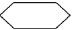
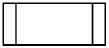
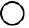

# Algoritmos e Programação Estruturada

APE-U1S1

- Algoritmo é uma sequência ordenada de passos, que devem ser seguidos, para atingir um objetivo.

- Simplificadamente, mostra como se resolve o problema.

- No caso de programação, mostra o que deve ser feito para solucionar o problema.

- O algoritmo vem antes da escrita de um programa (implementação).

- A partir do algoritmo pode-se escrever vários programas em linguagens diferentes (implementações), para resolver o problema descrito.

- Pode ser divido em 3 partes: Entrada, Processamento, Saída.

- Não existe um padrão bem definido para escrever algoritmos. Pode-se utilizar:
  
     - Diagrama de bloco.
     - Linguagem natural.
     - Pseudocódigo que lembra uma linguagem de programação simplificada.
     - Práticas comuns utilizadas em artigos e livros.
     - Python simplificado omitindo os detalhes.
     - Alguma outra prática comum existente.

## Linguagem natural

- É o que as pessoas conversam no dia-a-dia. Ex.:
1. Início.
2. Entrar com o primeiro valor (nota do primeiro bimestre).
3. Entrar com o segundo valor (nota do segundo bimestre).
4. Realizar a soma do primeiro valor com o segundo.
5. Realizar a divisão da soma dos valores por dois (média das notas dos
   bimestres).
6. Armazenar o valor encontrado.
7. Mostrar na tela o resultado da média.
8. Se a média do aluno for maior ou igual a seis.
9. O aluno será considerado aprovado.
10. Senão está reprovado.
11. Fim.

## Diagrama de blocos (fluxograma)

| Símbolo                                                               | Significado          | Descrição                                                                                                                               |
| --------------------------------------------------------------------- | -------------------- | --------------------------------------------------------------------------------------------------------------------------------------- |
|  | Terminal             | Representa o início ou o fim de um fluxo lógico. Em alguns casos define as sub-rotinas                                                  |
|  | Entrada manual       | Determina a entrada manual dos dados, geralmente por meio de um teclado                                                                 |
|  | Processamento        | Representa a execução de ações de processamento                                                                                         |
|  | Exibição             | Mostra o resultado de uma ação, geralmente através da tela de um computador                                                             |
|  | Decisão              | Representa os desvios condicionais nas operações de tomada de decisão e laços condicionais para repetição de alguns trechos do programa |
|  | Preparação           | Representa a execução de um laço incondicional que permite a modificação de instruções do laço                                          |
|  | Processo predefinido | Define um grupo de operações relacionadas a uma sub-rotina                                                                              |
|  | Conector             | Representa pontos de conexões entre trechos de programas, que podem ser apontados para outras partes do diagrama de bloco               |
|  | Linha                | Representa os vínculos existentes entre os símbolos de um diagrama de blocos                                                            |


## Pseudocódigo

<https://dev.to/flippedcoding/how-to-write-pseudo-code-2jfe>


## Conceitos de linguagem de programação

- Linguagem de máquina
- Linguagem de baixo nível (Assembly)

Exemplo:

```python
%%writefile hello.asm

GLOBAL  _start 

; Code goes in the text section
SECTION .text
_start: mov rax,1           ; 'write' system call = 1
        mov rdi,1           ; file descriptor 1 = STDOUT
        mov rsi,hello       ; string to write
        mov rdx,hLen        ; length of string to write
        syscall             ; call the kernel

        ; Terminate program
        mov rax,60          ; 'exit' system call
        mov rdi,0           ; exit with error code 0
        syscall             ; call the kernel

; Define variables in the data section
SECTION .rodata
hello:  db "Hello world!",10
hLen:   equ $-hello
```

    Writing hello.asm

```python
! nasm -f elf64 -l hello.lst hello.asm && ld hello.o && ./a.out
```

    Hello, World!

```python
! cat hello.lst
```

         1                                  GLOBAL  _start 
         2                                  
         3                                  ; Code goes in the text section
         4                                  SECTION .text
         5 00000000 B801000000              _start: mov rax,1           ; 'write' system call = 1
         6 00000005 BF01000000                      mov rdi,1           ; file descriptor 1 = STDOUT
         7 0000000A 48BE-                           mov rsi,hello       ; string to write
         7 0000000C [0000000000000000] 
         8 00000014 BA0D000000                      mov rdx,hLen        ; length of string to write
         9 00000019 0F05                            syscall             ; call the kernel
        10                                  
        11                                          ; Terminate program
        12 0000001B B83C000000                      mov rax,60          ; 'exit' system call
        13 00000020 BF00000000                      mov rdi,0           ; exit with error code 0
        14 00000025 0F05                            syscall             ; call the kernel
        15                                  
        16                                  ; Define variables in the data section
        17                                  SECTION .rodata
        18 00000000 48656C6C6F20776F72-     hello:  db "Hello world!",10
        18 00000009 6C64210A           
        19                                  hLen:   equ $-hello

## Paradigmas

Padrão de soluções de problemas, jeito de programar, recursos da linguagem. Algumas linguagens apresentam vários paradigmas, ex.: Python (orientado a objetos, imperativa, funcional, e outros)

- Programação imperativa
     - O programa é um passo-a-passo de como o resultado deve ser obtido. Ex: C.
- Programação orientada a objetos
     - O programa é uma coleção de objetos que se inter-relacionam. Ex.: C++.
- Programação funcional
     - Programação usando expressões e funções. Ex.: Lisp.
- Programação lógica
     - O programa é uma declaração dos resultados. Ex.: Prolog.

## Sintaxe

- São a regras e como o programa é escrito
     - Comandos, expressões, variáveis, etc.
- É geralmente escrito na sequência que se espera que seja executado.

## Alguns componentes do ambiente e da linguagem

- Interpretador/Compilador
- Bibliotecas/Linker
- Arquivos de cabeçalho. Ex: stdio.h
- Arquivos-fonte


<https://www.researchgate.net/figure/3-Compiler-and-Linker-Relationship_fig2_320142963>

## Hello, World!

<https://www.programiz.com/c-programming/examples/print-sentence>

```python
%%writefile hello.c

#include <stdio.h>

int main() {
   printf("Hello, World!\n");
}
```

    Overwriting hello.c

```python
! gcc hello.c && ./a.out
```

    Hello, World!

`stdio.h` é um **arquivo de cabeçalho** que declara

- tipos de variáveis
- macros
- funções

que lidam com entrada e saída. Faz parte da "Biblioteca Padrão C" que é um conjunto de macros, definições, rotinas, funções, e outros recursos, que fazem parte integrante da linguagem.

- void
- main()
- { }
- printf depende de stdio.h
     - se não for usar printf não precisa de stdio.h

### Comentários

<https://www.w3schools.com/c/c_comments.php>

```python
%%writefile p1.c

/* 
    O código abaixo imprimirá as palavras Hello World!
    na a tela. O "\n" significa ir para a próxima linha
*/

/**************************************************
 *                                                *
 *   Exemplo de comentário mais chamativo         *
 *                                                *
 **************************************************/

#include <stdio.h>

int main() {
    // printf() mostra na tela a string entre aspas
    printf("Hello, World!\n");  // Isso é um comentário
    /* Outro comentário */
}
```

    Overwriting p1.c

```python
! gcc p1.c && ./a.out
```

    Hello, World!

## C - variáveis e atribuições

Nota: a linguagem C não possui o tipo *String*. No lugar usa-se cadeia de caracteres terminado com um caracter nulo ("\0").

```python
%%writefile a.c

#include <stdio.h>

int a;
float b;
char c[10];

int main() {
    a = 1;
    b = 1.2;
    strcpy(c,"Abacaxi");

    printf("%d, %f, %s\n", a, b, c);
}
```

    Overwriting a.c

```python
! gcc a.c && ./a.out
```

    1, 1.200000, Abacaxi

## Python - variáveis e atribuições

Atribui um valor a uma variável:

```python
%%writefile var.py

a = 1
b = 1.2
c = "Abacaxi"

print(a, b, c)
```

    Writing var.py

```python
! python3 var.py
```

    1 1.2 Abacaxi

## Fortran - variáveis e atribuições

```python
%%writefile var.f90

program var
    integer a
    real b
    character(len=10) c

    a = 1
    b = 1.2
    c = "Abacaxi"

    print*, a, b, c
end
```

    Overwriting var.f90

```python
! gfortran -fimplicit-none var.f90 && ./a.out
```

               1   1.20000005     Abacaxi   

## C - operadores aritméticos

```python
%%writefile a.c

#include <stdio.h>

int main() {
    float a1, a2, b, c;

    a1 = 1 + 2 - 3 * 4 / 5;
    a2 = 1 + 2 - 3 * 4 / 5.0;
    b = 2 % 3;
    c = -2 + (-3);

    printf("%f, %f, %f, %f\n", a1, a2, b, c);
}
```

    Overwriting a.c

```python
! gcc a.c && ./a.out
```

    1.000000, 0.600000, 2.000000, -5.000000

- Apesar da variável `a1` ser `float`, os cálculos são feitos usando os tipos dos números da expressão, pela ordem de prioridade.
- Em `a1` o compilador inicia pela multiplicação e divisão, considera os números como inteiros, e usa aritmética inteira.
- Em `a2` o `5.0` faz com que o cálculo use aritmética de ponto flutuante.

## Python - operadores aritméticos

```python
%%writefile oper.py

a = 1 + 2 - 3 * 4 / 5
b = 2 % 3
c = -2 + (-3)

print(a, b, c)
```

    Overwriting oper.py

```python
! python3 oper.py
```

    0.6000000000000001 2 -5

## Fortran - operadores aritméticos

```python
%%writefile oper.f90

program var
    real a1, a2, b, c

    a1 = 1 + 2 - 3 * 4 / 5
    a2 = 1 + 2 - 3 * 4 / 5.0
    b = mod(2, 3)
    c = -2 + (-3)

    print*, a1, a2, b, c
end
```

    Overwriting oper.f90

```python
! gfortran -fimplicit-none oper.f90 && ./a.out
```

       1.00000000      0.599999905       2.00000000      -5.00000000    

- Para `a1` tem a mesma característica de C, fazendo os cálculos usando números inteiros.

## C - operadores relacionais

Notas:

- C usa constantes inteiras para representar valores boleanos, "0" = falso, e "1" = verdadeiro.
- Possui algumas facilidades como o arquivo de cabeçalho *stdbool.h* que define macros para facilitar a compreensão do código, p. ex. "bool" é um alias para "_Bool".

```python
%%writefile a.c

#include <stdio.h>

_Bool a, b, c, d;

int main() {

    a = 1 >= 2;
    b = 1 == 2;
    c = 1 != 2;
    d = 1234;

    printf("%d, %d, %d, %d\n", a, b, c, d);
}
```

    Overwriting a.c

```python
! gcc a.c && ./a.out
```

    0, 0, 1, 1

## Python - operadores relacionais

Um parâmetro → operador unário, dois → operador binário

```python
%%writefile rel.py

a = 1 >= 2
b = 1 == 2
c = 1 != 2
d = True

print(a, b, c, d)
```

    Overwriting rel.py

```python
! python3 rel.py
```

    False False True True

## C - tipos de dados (ou tipos de variáveis)

```python
%%writefile tip.c

#include <stdio.h>

int a = 1;
float b = 1.2;
char c[] = "Abacaxi";

int main() {
    printf("%d, %f, %s\n", a, b, c);
}
```

    Overwriting tip.c

```python
! gcc tip.c && ./a.out
```

    1, 1.200000, Abacaxi

## Python - tipos de dados

```python
%%writefile tip.py

a = 1
b = 1.2
c = "Abacaxi"

print(type(a), type(b), type(c))
```

    Writing tip.py

```python
! python3 tip.py
```

    <class 'int'> <class 'float'> <class 'str'>

## Fortran - tipos de dados

```python
%%writefile tip.f90

program var
    integer :: a = 1
    real :: b = 1.2
    character(len=10) :: c = "Abacaxi"

    print*, a, b, c
end
```

    Overwriting tip.f90

```python
! gfortran -fimplicit-none tip.f90 && ./a.out
```

               1   1.20000005     Abacaxi   

## Constantes

(variáveis que não mudam o valor)

### C - constantes

- C possui constantes "verdadeiras", que o compilador dá mensagem de erro quando são alteradas

```python
%%writefile con.c

const float pi = 3.14;

int main() {
    pi = 10;
}
```

    Overwriting con.c

```python
! gcc con.c && ./a.out
```

    con.c: In function ‘main’:
    con.c:5:8: error: assignment of read-only variable ‘pi’
        5 |     pi = 10;
          |        ^

### Python - constantes

- Em Python, constantes são variáveis comuns, apenas escritas em letras maiúsculas.
- É apenas uma indicação para o programador que devem ser tratadas com cuidado.
- Porém, nada impede que sejam alteradas.

```python
%%writefile con.py
PI = 3.14  # convenção: maiúsculas
print(PI)
PI = 10  # não é realmente uma constante
print(PI)
```

    Writing con.py

```python
! python3 con.py
```

    3.14
    10

## Fortran - constantes

```python
%%writefile con.f90

program var
    real, parameter :: pi = 3.14

    pi = 10
end
```

    Overwriting con.f90

```python
! gfortran -fimplicit-none con.f90 && ./a.out
```

    con.f90:5:4:
    
        5 |     pi = 10
          |    1
    Error: Named constant ‘pi’ in variable definition context (assignment) at (1)

## C - printf()

printf (“expressão de controle”, listas de argumentos)

Ex.: printf("%d, %f, %s\n", a, b, c);

| Código | Função                                 |
| ------ | -------------------------------------- |
| %c     | escrita de apenas um caractere         |
| %d     | números inteiros decimais              |
| %e     | números em notação científica          |
| %f     | números reais (ponto flutuante)        |
| %g     | %e ou %f no formato mais curto.        |
| %o     | números octais                         |
| %s     | série de caracteres                    |
| %u     | número decimal sem sinal               |
| %x     | número hexadecimal                     |
| %n󠇒   | entrada de uma sequência de caracteres |
| \n     | pula uma linha                         |

```python
%%writefile p4.c

#include <stdio.h>

float a = 3.141516;
float b = 1.23456;

int main() {
    printf("\n Resposta: a = %.2f e b = %.2f \n", a, b);
}
```

    Overwriting p4.c

```python
! gcc p4.c && ./a.out
```

     Resposta: a = 3.14 e b = 1.23 

## Python - print

```python
a = 3.141516
b = 1.23456

print(f"\n Resposta: a = {a:.2f} e b = {b:.2f} \n")
```

     Resposta: a = 3.14 e b = 1.23 

<https://www.pythonmorsels.com/string-formatting/>
