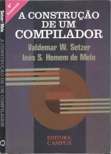
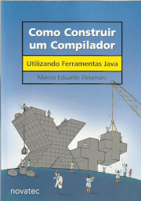
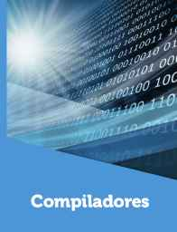

# Compiladores

2º sem 2023 e 2º sem 2020

## Ementa

- Estrutura de um compilador.
- Fundamentos de linguagens formais.
- Planejamento da construção de um compilador e a seleção de ferramentas.
- Análise léxica.
- Construção de um analisador léxico.
- Análise sintática.
- Tabela de símbolos e análise semântica.
- Tradução dirigida pela sintaxe.
- Tabela de símbolos.
- Geração de código intermediário.
- Geração de código e otimização de código.
- Especificação de uma proposta de linguagem inovadora.

## Introdução

Conforme [Steve Yegge](https://en.wikipedia.org/wiki/Steve_Yegge), chefe engenharia na `sourcegraph.com`, que foi gerente de desenvolvimento na Amazon, e engenheiro de software na Google, em seu *blog post* "[Rich Programmer Food](http://steve-yegge.blogspot.com/2007/06/rich-programmer-food.html)" :

> "Se você não conhece como os compiladores funcionam, então não sabe como os computadores funcionam. E por outro lado, se você não tem 100% de certeza de como compiladores funcionam, então não os conhece."

> "Construção de compiladores é (...) a segunda disciplina mais importante que você pode ter em um curso de graduação em Ciências da Computação."

> "Sistemas Operacionais, Aprendizado de Máquina, Computação Distribuída, e Construção de Algoritmos são tão importantes quanto Compiladores. Exceto pelo fato de que você continuará sem saber como os computadores funcionam."

Desenvolver compiladores geralmente é uma tarefa árdua, porém é uma oportunidade de aprender a utilizar várias áreas da ciência da computação em uma implementação. Esse conhecimento adquirido pode ser utilizado em diversas outras aplicações, não se limitando a compiladores.

Conhecer o funcionamento do compilador é importante para poder extrair o máximo de seus recursos, como por exemplo, durante a fase de depuração de um sistema. Além disso, ele é um programa de computador, e vários são de código livre e podem ser modificados pelo programador para atender uma demanda em especial, caso necessário.

"Compiladores" não se limita apenas a área de compiladores, abrangendo outras áreas como: interpretadores, arquitetura dos ambientes e linguagens de programação, de que forma os programas podem ser otimizados para execução em arquiteturas de computador, projeto de novas arquiteturas, simulação compilada, ferramentas de produtividade de software, processamento de linguagem natural, como extrair desempenho da arquitetura para aplicações científicas, como melhor utilizar os recursos dos compiladores (ou interpretadores) em aplicações e arquiteturas de IoT, dentre outras.

## Referências

   

- SETZER, V. W.; MELO, I. S. H. [A construção de um compilador](https://archive.org/details/a-construcao-de-um-compilador-r1.2). 1989.
- AHO, A. V. et al. [Compiladores: princípios, técnicas e ferramentas](https://www.amazon.com.br/Compiladores-princ%C3%ADpios-ferramentas-Alfred-Aho/dp/8588639246). 2008.
- FEDOZZI, R. [Compiladores](http://cm-kls-content.s3.amazonaws.com/201802/INTERATIVAS_2_0/COMPILADORES/U1/LIVRO_UNICO.pdf). 2018.
- DELAMARO, M. [Como Construir um Compilador Utilizando Ferramentas Java](https://sites.icmc.usp.br/delamaro/SlidesCompiladores/CompiladoresFinal.pdf). 2004.
- LOUDEN, K. C. [Compiler Construction: Principles and Practice](https://books.google.com.br/books?id=vXchAQAAIAAJ). 1997.
- LOUDEN, K. C. et al. [Programming languages: principles and practices](https://books.google.com.br/books?id=DcgIAAAAQBAJ). 2011.
- GRUNE, D. et al. [Modern compiler design](https://books.google.com.br/books?id=zkpFTBtK7a4C).  2012.
- WIRTH, N. [Algorithms + Data Structures = Programs](https://books.google.com.br/books?id=O6FQAAAAMAAJ). 1976.
- COOPER, K.; TORCZON, L.. [Construindo Compiladores](https://books.google.com.br/books?id=rJKoBQAAQBAJ). 2017.
- FISCHER, C. N.; CYTRON, R. K.; LEBLANC Jr., R. J. [Crafting a Compiler](https://books.google.com.br/books?id=GSYrAAAAQBAJ). 2010.
- PRICE, A. M. de A.; TOSCANI, S. S. [Implementação de linguagens de programação: compiladores](https://books.google.com.br/books?id=O7ZzPgAACAAJ). 2001.

### TCCs

- TOMAZELLI, G. [Implementação de um compilador para uma linguagem de programação com geração de código Microsoft .NET Intermediate Language](http://campeche.inf.furb.br/tccs/2004-I/2004-1giancarlotomazellivf.pdf). 2004.
- BERGSTEN, N. A. L. [Um compilador Portugol-assembly para microcontrolador](http://www.ecomp.uefs.br/data/tcc/UM%20COMPILADOR%20PORTUGOL-ASSEMBLY%20PARA%20MICROCONTROLADOR.pdf). 2012.

## A Construção de um Compilador

Página com minhas notas sobre o livro "A Construção de um Compilador" de W. Setzer, e I. Melo. <https://efurlanm.github.io/ldi/buildcomp/>

## Sites de Professores

Contendo informações úteis sobre compiladores

- [Prof. Valdemar Setzer](https://www.ime.usp.br/~vwsetzer/)
- [Prof. Márcio Delamaro](https://sites.icmc.usp.br/delamaro/)
- [Prof. Marcurs Ramos](http://www.marcusramos.com.br/univasf/)
- [Prof. Guilherme Galante](https://sites.google.com/site/guigalante/home/compiladores-2016)
- [Prof. Sérgio Costa](https://profsergiocosta.github.io/teaching/compiladores)
- [Prof. Aleardo Manacero](https://www.dcce.ibilce.unesp.br/~aleardo/cursos/compila/index.html)
- [Prof. Ricardo Rocha](https://bv.fapesp.br/pt/pesquisador/33459/ricardo-luis-de-azevedo-da-rocha/)

## Ferramentas

- Compilador educativo Verto
     - <http://www.cinted.ufrgs.br/renoteold/nov2005/artigosrenote/a19_verto.pdf>
     - <http://www.cinted.ufrgs.br/renoteold/nov2005/apresentacoes/ap19_verto.pdf>
     - <http://verto.sourceforge.net>
- Máquina Hipotética Cesar
     - <http://www.inf.ufrgs.br/arq/wiki/doku.php?id=cesar>
     - <https://pt.wikipedia.org/wiki/M%C3%A1quinas_hipot%C3%A9ticas_da_Universidade_Federal_do_Rio_Grande_do_Sul>
- Computador hipotético HIPO
     - <https://www.ime.usp.br/~vwsetzer/HIPO/hipo-descr.html>
     - <https://www.ime.usp.br/~vwsetzer/HIPO/using-the-HIPO-simulator.html>
     - <https://seijihariki.github.io/HIPO-simulator>
     - <https://github.com/seijihariki/HIPO-simulator>
     - <https://www.ime.usp.br/~jstern/miscellanea/MaterialDidatico/hipo.htm>
     - <https://www.ime.usp.br/~jstern/software/hipo/Hipo.pdf>
     - [Exemplo de código HIPO](hipo.md) - anotações sobre o computador HIPO
- Compilador online interativo que permite inserir código fonte, e ver o código objeto gerado
     - Compiler Explorer: <https://godbolt.org/>
     - penguinTrace: <https://penguintrace.org/intro/>

## Vídeos de interesse

- ENGELSMA, J. Tutorial on LEX. <https://youtu.be/54bo1qaHAfk>
- PARIZOTTO, L. Fundamentos de linguagens formais. <https://youtu.be/L3qZF6Mw62U>
- TECHNOLOGIKÁ. A diferença entre compilador e interpretador. <https://youtu.be/aJww2aXJtc4>
- FERREIRA, E. W. T. Compiladores: Construção do Analisador Léxico. <https://youtu.be/pud18CZ81VE>
- ROCHA, R. L. A. Linguagens e Compiladores. UNIVESP.
     - Apresentação. <https://youtu.be/lfGqYLYXdSY>
     - Conceitos de Linguagens de Programação e Análise Léxica. <https://youtu.be/kazE4zPRsxc>
     - Conceitos de Análise Sintática e Análise Sintática Descendente. <https://youtu.be/JQ92w5oDyb0>
     - Análise Sintática Ascendente. <https://youtu.be/JUoEAhciEnU>
     - Tradução dirigida por sintaxe. <https://youtu.be/_kGAgukarkk>
     - Código intermediário. <https://youtu.be/Asj7JNZmxb4>
     - Ambientes de execução. <https://youtu.be/jZJEi7Wb6_o>
     - Geração de código, noções de otimização. <https://youtu.be/oVi91pFqHlQ>

## *Links* de interesse

- [*Why you should take a Compilers course*](https://anoopsarkar.github.io/compilers-class/assets/lectures/in1-evangelize-compilers.pdf)
- [*(When) Should I learn compilers*?](https://stackoverflow.com/questions/733093/when-should-i-learn-compilers)
- [Compilador](https://pt.wikipedia.org/wiki/Compilador)
- [Interpretador](https://pt.wikipedia.org/wiki/Interpretador)
- [Linker](https://pt.wikipedia.org/wiki/Ligador)
- [GNU *Compiler Collection* (GCC)](https://en.wikipedia.org/wiki/GNU_Compiler_Collection)
- [GNU Pascal (GPC)](https://en.wikipedia.org/wiki/GNU_Pascal)
- [GCC vs. Clang/LLVM: *An In-Depth Comparison of C/C++ Compilers*](https://medium.com/@alitech_2017/gcc-vs-clang-llvm-an-in-depth-comparison-of-c-c-compilers-899ede2be378)
- [Repositório da disciplina "Compiladores" do curso Ciência da Computação do CEULP/ULBRA](https://github.com/jacksongomesbr/academia-compiladores)
- [*Free Grammars for Programming Languages* - C. Heng](https://www.thefreecountry.com/sourcecode/grammars.shtml)
- [*Free Compilers and Interpreters* - C. Heng](https://www.thefreecountry.com/compilers/index.shtml)
- [*Compiler Construction* - Wikibooks](https://en.wikibooks.org/wiki/Compiler_Construction)
- [GNU C *Compiler Internals* - Wikibooks](https://en.wikibooks.org/wiki/GNU_C_Compiler_Internals)
- [*How to Write a Compiler* - Wikibooks](https://en.wikibooks.org/wiki/How_to_Write_a_Compiler)
- [Inger: interpretador simples e documentação](http://inger.sourceforge.net/html/about.html)
- [Writing your own programming language and compiler with Python](https://blog.usejournal.com/writing-your-own-programming-language-and-compiler-with-python-a468970ae6df)
- [Compiler Design Tutorial](https://www.javatpoint.com/compiler-tutorial)
- [*Compiler Design and Construction* - FreeTechBooks](https://www.freetechbooks.com/compiler-design-and-construction-f14.html)
- [*Compiler - Digital Library* - stmik-banjarbaru.ac.id](http://digilib.stmik-banjarbaru.ac.id/index.php?dir=&search=compiler&search_mode=f)
- [Compiler Design Tutorial](https://www.guru99.com/compiler-design-tutorial.html)
- [Curlie: compilers directory](https://curlie.org/en/Computers/Programming/Compilers)

## Pascal

- [Por que Pascal ?](pascal.md) - anotações sobre a linguagem Pascal.

 Last edited: 2025-02-23 11:41:07
