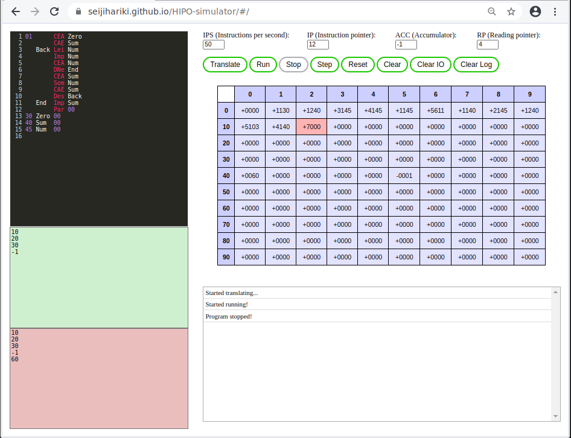

# Computador hipotético HIPO

Interpretador baseado na Web para o computador educacional HIPO.

- <https://github.com/seijihariki/HIPO-simulator/>
- <https://seijihariki.github.io/HIPO-simulator/#/>

## Exemplo de código

    01      CEA Zero
            CAE Sum
       Back Lei Num
            Imp Num
            CEA Num
            DNe End
            CEA Sum
            Som Num
            CAE Sum
            Des Back
       End  Imp Sum
            Par 00
    30 Zero 00
    40 Sum 00
    45 Num 00

## Entrada

    10
    20
    30
    -1

## Saída

    10
    20
    30
    -1
    60
    
## Printscreen do simulador

 Last edited: 2024-11-17 20:09:02
