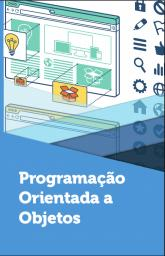
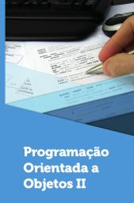
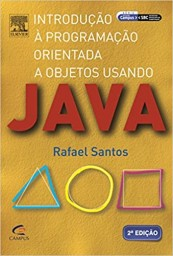
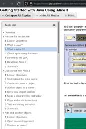
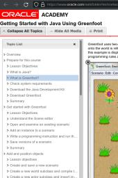

# Linguagem Orientada a Objetos

1º sem 2023 e 2º sem 2022

## Ementa

- Conceitos do desenvolvimento orientado a objetos
    - Classes e objetos, aplicações, métodos, instâncias e atributos
    - Objetos, procedimentos e argumentos, funções e estruturas de controle
    - Métodos, variáveis, parâmetros, propriedades
- Estruturas do desenvolvimento orientado a objetos
    - Atributos, métodos estáticos, construtores, sobrecarga e sobreposição
    - Estruturas de decisão, controle e repetição
    - Encapsulamento, herança, modificadores de acesso, e polimorfismo
- Desenvolvimento de classes abstratas, exceções e interfaces orientada a objetos
    - Exceções, criação de tipos, asserções, classes abstratas, herança
    - Interfaces
    - Interface gráfica com usuário
- Aplicações orientada a objetos
    - *Arrays* unidimensionais e multidimensionais, *String*, e *StringBuffer*
    - Conexão com banco de dados *MySql*, *NoSql*, *MongoDB*
    - *Threads*, concorrência, sincronização, e exceções

## Referências

    

- MAITINO NETO, R. Programação orientada a objetos. Londrina: Editora e Distribuidora Educacional S.A, 2018. ISBN 978-85-522-0766-5
- ANDRIJAUSKAS, F. Programação orientada a objetos II. Londrina: Editora e Distribuidora Educacional S.A, 2018. ISBN 978-85-522-1166-2
- SANTOS, R. Introdução à programação orientada a objetos usando java. [S. l.]: Elsevier Brasil, 2013. ISBN 978-85-352-8429-4
- Alice
    - ORACLE. *Getting Started with Java Using Alice 3*. <https://www.oracle.com/webfolder/technetwork/tutorials/OracleAcademy/Alice3SelfStudyV2/index.html>
    - Carnegie Mellon University. *Alice Website*. <https://www.alice.org/>
    - BARNUM, B. *This playlist contains a series of Alice 3 programming tutorials*. <https://www.youtube.com/playlist?list=PLmpmyPywZ440OmMec0WWu6jqdqCXMd8Td>
    - FILITTO, D. *Introdução a lógica de programação orientada a objetos utilizando a ferramenta Alice*. <https://www.youtube.com/playlist?list=PLfvOpw8k80WpEULuLEIZIJFakzJ8WUBAC>
- Greenfoot
    - ORACLE. *Getting Started with Java Using Greenfoot*. <https://www.oracle.com/webfolder/technetwork/tutorials/OracleAcademy/GreenfootSelfStudyV1/obe.html> (2023-01-30)
    - University of Kent in Canterbury. *Greenfoot Website*. <https://www.greenfoot.org>
    - CHANNEL GREENFOOT. <https://www.youtube.com/@18km>
    - TORRES, A. *Introdução à Criação de Jogos com JAVA utilizando o Greenfoot*. <https://youtu.be/y2uQb8JbnRI>

## Videos de interesse

- FERNANDADEV. *Classes, Objetos, Atributos e Métodos*. <https://youtu.be/ohmHbdUhAGc> (U1S1)
- FILITTO, D. *Introdução a lógica de programação orientada a objetos utilizando a ferramenta Alice*. <https://www.youtube.com/playlist?list=PLfvOpw8k80WpEULuLEIZIJFakzJ8WUBAC> (U1S2)
- TORRES, A. *Introdução à Criação de Jogos com JAVA utilizando o Greenfoot*. <https://youtu.be/y2uQb8JbnRI> (U1S3)
- FERNANDADEV. *Construtores*. <https://youtu.be/wOJbwdLmwCA> (U2S1)
- BOSON TREINAMENTOS. *Laço While Estrutura de Repetição*. <https://youtu.be/VpcYTn_Kqdc> (U2S2)
- CURSO EM VIDEO. *Herança*. <https://youtu.be/19IGAeoFKlU> (U2S3)
- CFBCURSOS. *Classes abstratas*. <https://youtu.be/c3MWCJYFTRI> (U3S1)
- CFBCURSOS. *Interface em Java*. <https://youtu.be/ZgwR4g5spvU> (U3S2)
- GUIMARÃES, M. *Redimensionamento Componentes Swing em Java*. <https://youtu.be/ICqB7I_DmWg> (U3S3)
- DEVDOJO. *Arrays multidimensionais*. <https://youtu.be/EalQ6X_RtJk> (U4S1)
- NAPOLEÃO JR., Prof. R. *Como criar uma conexao JDBC com banco de dados MYSQL em Java*. <https://youtu.be/70s7JsiaBRc> (U4S2)
- GRONER, L. *Criando Threads*. <https://youtu.be/v5l30QMKv6c> (U4S3)

## *Links* de interesse

- BRASIL ESCOLA. *Seminário*. <https://brasilescola.uol.com.br/redacao/o-seminarioque-e-como-realizalo.htm>
- ROCHA, F. *Como fazer seminário?* <https://youtu.be/3l6D0rgEdAI>
- MAY, F. *Dicas Para Apresentar Trabalho Escolar*. <https://youtu.be/Xokn9aWLD08>
- BRASIL ESCOLA. *Relatório*. <https://youtu.be/s_ogx2xROb0>
- DOS REIS, A. D. *Elaboração de Projeto*. <https://youtu.be/S-4tSLwc_yU>
- SCHULTZ, C. *GanttProject*. <https://www.youtube.com/@xxultz/search?query=ganttproject> (Software para Cronograma)

## Projeto final da disciplina

- [Links de interesse e algumas informações adicionais](https://github.com/efurlanm/teaching/blob/main/projeto.md)

## Material

- [Pasta compartilhada no Google Drive](https://drive.google.com/drive/folders/1wlkBIcKHDTdjmopo-5cJ-stTVTWylWlV)

 Last edited: 2025-04-25 14:13:04
