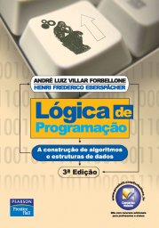
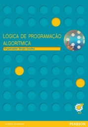

# Linguagem de Programação

Caracterização das linguagens de programação de computadores e de seus diferentes paradigmas de programação (lógico, procedimental, funcional, orientação a objetos, visual, e orientado a eventos). Estudo de conceitos básicos para no que se refere a linguagens: implementação, estrutura de dados, abstração de dados, controle, tipos, escopo, subrotina, corotina, passagem de parâmetro, recursividade, sintaxe, semântica.

## Referências

  

- FORBELLONE, André Luiz Villar; EBERSPÄCHER, Henri Frederico. *Lógica de programação*: a construção de algoritmos e estruturas de dados. 3. ed. São Paulo: Prentice Hall Brasil, 2005.
- GUEDES, Sérgio (Org.). *Lógica de programação algorítmica*. São Paulo: Pearson Education Brasil, 2014.
- SEBESTA, Robert W. *Conceitos de linguagens de programação*. 9. ed. Porto Alegre: Bookman, 2011.

 Last edited: 2025-05-13 13:25:50
