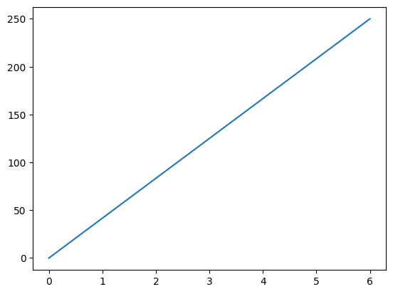
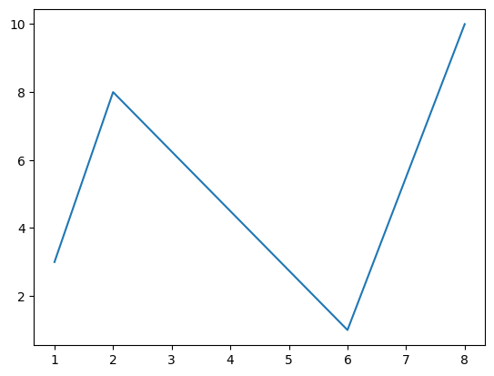
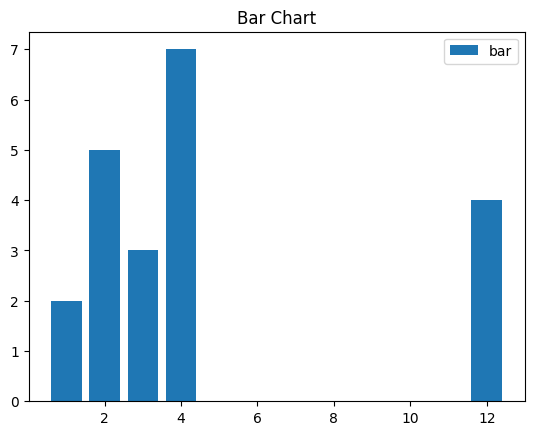
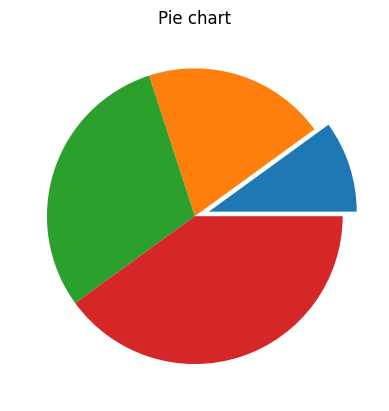
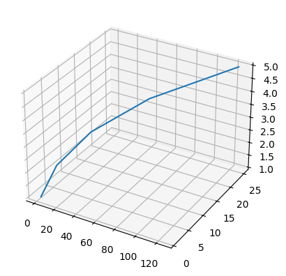

# Bibliotecas e módulos

Módulo permite criar uma funcionalidade que pode ser reaproveitada em outros códigos.


```python
%%writefile oimundo.py
def oimundo() :
    print("Oi, mundo!")
```

    Writing oimundo.py


```python
! dir oimundo.py
```

     Volume in drive D is 0032D1
     Volume Serial Number is 4C19-A1A5
    
     Directory of D:\WPy64-31330\notebooks
    
    06/05/2025  15:17                42 oimundo.py
                   1 File(s)             42 bytes
                   0 Dir(s)  19,378,569,216 bytes free


```python
import oimundo as oi
```

(se não funcionar, precisa reinicializar o kernel)


```python
oi.oimundo()
```

    Oi, mundo!


---


```python
%%writefile bibl01.py
def f01() :
    print("Primeira função")
def f02() :
    print("Segunda função")
```

    Writing bibl01.py


```python
from bibl01 import f02
```

(se não funcionar, precisa reinicializar o kernel)


```python
f02()
```

    Segunda função


```python
import bibl01 as b
```


```python
b.f01()
```

    Primeira função


```python
b.f02()
```

    Segunda função


---

É uma boa prática declarar na sequência:
- primeiro as bibliotecas-padrão (módulos built-in) que fazem parte do Python padrão
- depois as bibliotecas de terceiros, geralmente carregadas via um gerenciador de pacotes
- e, por fim, os módulos específicos criados para a aplicação


```python
import numpy
import matplotlib
import bibl01
```

---

## Módulo OS


```python
import os
from os import listdir as ld
```


```python
os.getcwd()
```


    'D:\\WPy64-31330\\notebooks'


```python
print(os.listdir())
```

    ['docs', '32-33-modulos-bd.ipynb', '.ipynb_checkpoints', 'oimundo.py', '__pycache__', 'bibl01.py', '.virtual_documents']


```python
print(ld())
```

    ['docs', '32-33-modulos-bd.ipynb', '.ipynb_checkpoints', 'oimundo.py', '__pycache__', 'bibl01.py', '.virtual_documents']


```python
os.cpu_count()
```


    2


```python
print(os.getlogin()) #user logged in on the controlling terminal of the process.
```

    y


```python
import getpass
```


```python
getpass.getuser()
```


    'y'


```python
os.getenv('PATH')
```


    'D:\\WPy64-31330\\python\\Lib\\site-packages\\PyQt5;D:\\WPy64-31330\\python\\;D:\\WPy64-31330\\python\\DLLs;D:\\WPy64-31330\\python\\Scripts;D:\\WPy64-31330\\python\\..\\t;D:\\WPy64-31330\\python\\..\\n;C:\\Windows\\system32;C:\\Windows;C:\\Windows\\System32\\Wbem;C:\\Windows\\System32\\WindowsPowerShell\\v1.0\\;C:\\Windows\\System32\\OpenSSH\\;C:\\Users\\y\\AppData\\Local\\Microsoft\\WindowsApps;'


```python
os.getpid()
```


    1152


## Repositórios

- Pypi https://pypi.org/  : específico Python
- Anaconda https://anaconda.org/  : outros softwares também

Tratamento de imagens

- Pillow: suporte a formatos de arquivos
- OpenCV: algoritmos de visão computacional
- Luminoth: visão computacional
- Mahotas: visão computacional

Visualização de dados

- Matplotlib: gráficos
- Bokeh: visualização interativa
- Seaborn: gráficos estatísticos
- Altair: visualização estatítstica

Tratamento de dados

- Pandas: estruturas de dados
- NumPy: biblioteca científica
- Pyspark: clusters
- Pingouim: pacote estatístico baseado em Pandas

Tratamento de textos

Internet, rede e cloud

Acesso a bancos de dados

Apresndizado de máquina

Jogos

## Matplotlib


```python
import numpy as np
import matplotlib.pyplot as plt 
```


```python
xpoints = np.array([0, 6])
ypoints = np.array([0, 250])

plt.plot(xpoints, ypoints)
plt.show()
```


    

    


```python
xpoints = np.array([1, 2, 6, 8])
ypoints = np.array([3, 8, 1, 10])

plt.plot(xpoints, ypoints)
plt.show()
```


    

    


```python
# data to display on plots 
x = [3, 1, 3, 12, 2, 4, 4] 
y = [3, 2, 1, 4, 5, 6, 7] 
  
# This will plot a simple bar chart
plt.bar(x, y)
  
# Title to the plot
plt.title("Bar Chart")
  
# Adding the legends
plt.legend(["bar"])
plt.show()
```


    

    


```python
# data to display on plots 
x = [1, 2, 3, 4] 
  
# this will explode the 1st wedge
# i.e. will separate the 1st wedge
# from the chart
e  =(0.1, 0, 0, 0)
  
# This will plot a simple pie chart
plt.pie(x, explode = e)
  
# Title to the plot
plt.title("Pie chart")
plt.show()
```


    

    


```python
x = [1, 2, 3, 4, 5]
y = [1, 4, 9, 16, 25]
z = [1, 8, 27, 64, 125]
# Creating the figure object
fig = plt.figure()
# keeping the projection = 3d
# creates the 3d plot
ax = plt.axes(projection = '3d')
ax.plot3D(z, y, x)
```


    [<mpl_toolkits.mplot3d.art3d.Line3D at 0x1df52de3390>]


    

    


<hr style="height:20px;border-width:0;background-color:green">

# Banco de dados

Ao criar uma aplicação em uma linguagem de programação que precisa acessar um sistema gerenciador de banco de dados relacional (RDBMS), uma vez que são processos distintos, é preciso criar uma conexão entre eles. Após estabelecida a conexão, é possível (de alguma forma) enviar comandos SQL para efetuar as ações no banco (RAMAKRISHNAN; GEHRKE, 2003). Para fazer a conexão e permitir que uma linguagem de programação se comunique com um banco de dados com a utilização da linguagem SQL, podemos usar as tecnologias ODBC (Open Database Connectivity) e JDBC (Java Database Connectivity).

## Sqlite3


```python
import sqlite3
```

cria ou abre o arquivo em disco:


```python
conn = sqlite3.connect('aulaDB.db')
```

além do `connect`, também é necessário um `cursor` para fazer a ponte com o bd:


```python
cursor = conn.cursor()
```

Agora que temos uma conexão com um banco de dados, vamos utilizar uma instrução DDL da linguagem SQL para criar a tabela fornecedor. O comando SQL que cria a tabela fornecedor está no código a seguir e foi guardado em uma variável chamada ddl_create. Caso execute todas as células novamente, certifique-se de apagar a tabela no banco, para evitar o erro.

neste caso os comandos sql são armazenados em uma variável string:


```python
comandos = """
CREATE TABLE fornecedor (
id_fornecedor INTEGER NOT NULL PRIMARY KEY AUTOINCREMENT,
nome_fornecedor TEXT NOT NULL,
cnpj VARCHAR(18) NOT NULL,
cidade TEXT,
estado VARCHAR(2) NOT NULL,
cep VARCHAR(9) NOT NULL,
data_cadastro DATE NOT NULL
);
"""
```

executa os comandos sql:


```python
cursor.execute(comandos)
```


    <sqlite3.Cursor at 0x1df54fe94c0>


fecha tudo:


```python
cursor.close()
```


```python
conn.close()
```

mais comandos:


```python
comandos = """
INSERT INTO fornecedor (nome_fornecedor, cnpj, cidade, estado, cep, data_cadastro)
VALUES ('Empresa A', '11.111.111/1111-11', 'São Paulo', 'SP', '11111-111', '2020-01-01')
"""
```

abre de novo:


```python
conn   = sqlite3.connect('aulaDB.db')
cursor = conn.cursor()
```


```python
cursor.execute(comandos)
```


    <sqlite3.Cursor at 0x1df4ebadd40>


```python
comandos = """
INSERT INTO fornecedor (nome_fornecedor, cnpj, cidade, estado, cep, data_cadastro)
VALUES ('Empresa B', '22.222.222/2222-22', 'Rio de Janeiro', 'RJ', '22222-222', '2020-01-01')
"""
```


```python
cursor.execute(comandos)
```


    <sqlite3.Cursor at 0x1df4ebadd40>


```python
comandos = """
INSERT INTO fornecedor (nome_fornecedor, cnpj, cidade, estado, cep, data_cadastro)
VALUES ('Empresa C', '33.333.333/3333-33', 'Curitiba', 'PR', '33333-333', '2020-01-01')
"""
```


```python
cursor.execute(comandos)
```


    <sqlite3.Cursor at 0x1df4ebadd40>


Caso tenha ficado alguma coisa pendente:


```python
conn.commit()
```

mostra o que inserimos no bd:


```python
comandos = """
SELECT * FROM fornecedor
"""
```


```python
cursor.execute(comandos)
```


    <sqlite3.Cursor at 0x1df4ebadd40>


```python
resultado = cursor.fetchall()
```


```python
print(resultado)
```

    [(1, 'Empresa A', '11.111.111/1111-11', 'São Paulo', 'SP', '11111-111', '2020-01-01'), (2, 'Empresa B', '22.222.222/2222-22', 'Rio de Janeiro', 'RJ', '22222-222', '2020-01-01'), (3, 'Empresa C', '33.333.333/3333-33', 'Curitiba', 'PR', '33333-333', '2020-01-01')]


```python
for linha in resultado :
    print(linha)
```

    (1, 'Empresa A', '11.111.111/1111-11', 'São Paulo', 'SP', '11111-111', '2020-01-01')
    (2, 'Empresa B', '22.222.222/2222-22', 'Rio de Janeiro', 'RJ', '22222-222', '2020-01-01')
    (3, 'Empresa C', '33.333.333/3333-33', 'Curitiba', 'PR', '33333-333', '2020-01-01')


```python
cursor.execute("SELECT * FROM fornecedor WHERE id_fornecedor = 2")
resultado = cursor.fetchall()
print(resultado)
```

    [(2, 'Empresa B', '22.222.222/2222-22', 'Rio de Janeiro', 'RJ', '22222-222', '2020-01-01')]


```python
cursor.close()
conn.close()
```

## Update


```python
conn = sqlite3.connect('aulaDB.db')
cursor = conn.cursor()
```


```python
cursor.execute("UPDATE fornecedor SET cidade = 'Campinas' WHERE id_fornecedor = 2")
conn.commit()
```


```python
cursor.execute("SELECT * FROM fornecedor")
for linha in cursor.fetchall():
    print(linha)
```

    (1, 'Empresa A', '11.111.111/1111-11', 'São Paulo', 'SP', '11111-111', '2020-01-01')
    (2, 'Empresa B', '22.222.222/2222-22', 'Campinas', 'RJ', '22222-222', '2020-01-01')
    (3, 'Empresa C', '33.333.333/3333-33', 'Curitiba', 'PR', '33333-333', '2020-01-01')


```python
cursor.close()
conn.close()
```

## Delete


```python
conn = sqlite3.connect('aulaDB.db')
cursor = conn.cursor()
```


```python
cursor.execute("DELETE FROM fornecedor WHERE id_fornecedor = 2")
conn.commit()
```


```python
cursor.execute("SELECT * FROM fornecedor")
for linha in cursor.fetchall():
    print(linha)
```

    (1, 'Empresa A', '11.111.111/1111-11', 'São Paulo', 'SP', '11111-111', '2020-01-01')
    (3, 'Empresa C', '33.333.333/3333-33', 'Curitiba', 'PR', '33333-333', '2020-01-01')


```python
cursor.close()
conn.close()
```

## Informações


```python
conn = sqlite3.connect('aulaDB.db')
cursor = conn.cursor()
```


```python
cursor.execute("""SELECT name FROM sqlite_master WHERE type='table' ORDER BY name""")
print('Tabelas:')
for tabela in cursor.fetchall():
    print(tabela)
```

    Tabelas:
    ('fornecedor',)
    ('sqlite_sequence',)


```python
tabela = 'fornecedor'
cursor.execute(f"""SELECT sql FROM sqlite_master WHERE type='table' AND name='{tabela}'""")
print(f'\nDDL da tabela {tabela}:')
for schema in cursor.fetchall():
    print("%s" % (schema))
```

    
    DDL da tabela fornecedor:
    CREATE TABLE fornecedor (
    id_fornecedor INTEGER NOT NULL PRIMARY KEY AUTOINCREMENT,
    nome_fornecedor TEXT NOT NULL,
    cnpj VARCHAR(18) NOT NULL,
    cidade TEXT,
    estado VARCHAR(2) NOT NULL,
    cep VARCHAR(9) NOT NULL,
    data_cadastro DATE NOT NULL
    )


```python
cursor.close()
conn.close()
```

<br><sub>Last edited: 2025-05-13 13:25:46</sub>
