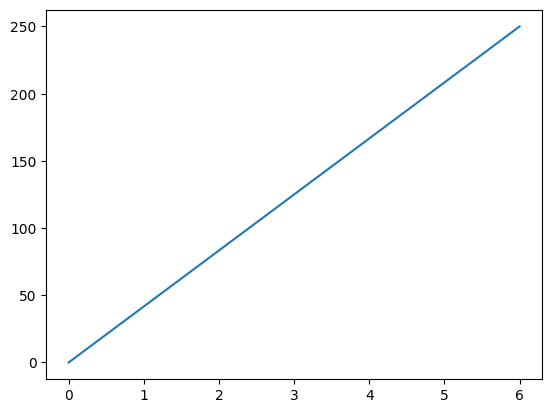
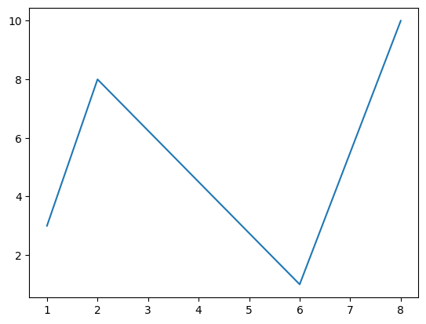
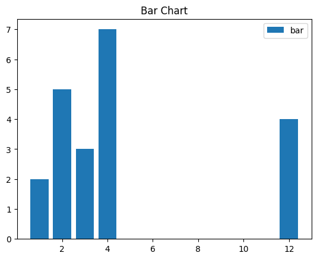
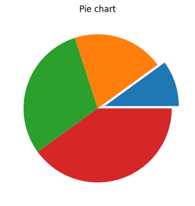
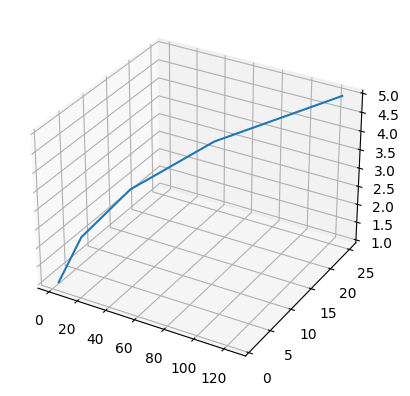

# Bibliotecas e módulos

Módulo permite criar uma funcionalidade que pode ser reaproveitada em outros códigos.


```python
%%writefile oimundo.py
def oimundo() :
    print("Oi, mundo!")
```

    Writing oimundo.py


```python
import oimundo as oi
```


```python
oi
```


    <module 'oimundo' from '/home/x/Documents/teach/lprog/aulas/oimundo.py'>


```python
oimundo()
```

    Oi, mundo!


---


```python
%%writefile bibl01.py
def f01() :
    print("Primeira função")
def f02() :
    print("Segunda função")
```

    Writing bibl01.py


```python
from bibl01 import f02 as f
```


```python
f01()
```


    ---------------------------------------------------------------------------

    NameError                                 Traceback (most recent call last)

    Cell In[9], line 1
    ----> 1 f01()


    NameError: name 'f01' is not defined


```python
f02()
```


    ---------------------------------------------------------------------------

    NameError                                 Traceback (most recent call last)

    Cell In[10], line 1
    ----> 1 f02()


    NameError: name 'f02' is not defined


```python
f()
```

    Segunda função


```python
f
```


    <function bibl01.f02()>


```python
import bibl01 as b
```


```python
b.f01()
```

    Primeira função


```python
b.f02()
```

    Segunda função


```python
from bibl01 import f01 as f1, f02 as f2
```


```python
f1()
```

    Primeira função


É uma boa prática declarar na sequência:
- primeiro as bibliotecas-padrão (módulos built-in) que fazem parte do Python padrão
- depois as bibliotecas de terceiros, geralmente carregadas via um gerenciador de pacotes
- e, por fim, os módulos específicos criados para a aplicação


```python
import numpy
import matplotlib
import bibl01
```

---

## Módulo Random


```python
import random as rd
```


```python
rd.randint(10, 20)
```


    12


```python
rd.choice([1, 3, 5, 7, 11])
```


    7


```python
rd.sample(range(10), 3)
```


    [9, 4, 3]


## Módulo OS


```python
import os
from os import listdir as ld
```


```python
os.getcwd()
```


    '/home/x/Documents/teach/lprog/aulas'


```python
print(os.listdir())
```

    ['9_other', 'oimundo.py', 's23.ipynb', 's111213.ipynb', 's2122.ipynb', '.ipynb_checkpoints', 'bibl01.py', 'aula_31.ipynb', 'aula_32.ipynb', '__pycache__']


```python
print(ld())
```

    ['9_other', 'oimundo.py', 's23.ipynb', 's111213.ipynb', 's2122.ipynb', '.ipynb_checkpoints', 'bibl01.py', 'aula_31.ipynb', 'aula_32.ipynb', '__pycache__']


```python
os.cpu_count()
```


    4


```python
print(os.getlogin()) #user logged in on the controlling terminal of the process.
```


    ---------------------------------------------------------------------------

    OSError                                   Traceback (most recent call last)

    Cell In[36], line 1
    ----> 1 print(os.getlogin())


    OSError: [Errno 6] No such device or address


```python
import getpass
```


```python
getpass.getuser()
```


    'x'


```python
os.getenv('PATH')
```


    '/usr/local/sbin:/usr/local/bin:/usr/sbin:/usr/bin:/sbin:/bin'


```python
os.getpid()
```


    30548


## Módulo RE

Expressão Regular (RE)

- match procura no início da string
- search procura na string inteira


```python
import re
```


```python
string_with_newlines = """something
someotherthing"""
```


```python
re.match('some', string_with_newlines)
```


    <re.Match object; span=(0, 4), match='some'>


não encontra pois não está no início:


```python
re.match('someotherthing', string_with_newlines)
```

o search acha:


```python
re.search('someotherthing', string_with_newlines)
```


    <re.Match object; span=(10, 24), match='someotherthing'>


### Exemplo com RE:


```python
re.search('[a-zA-Z]*', 'meuArquivo_20-01-2020.py')
```


    <re.Match object; span=(0, 10), match='meuArquivo'>


```python
re.match(padrao, string)
```


    <re.Match object; span=(0, 10), match='meuArquivo'>


### groups, group, e groupdict:


```python
m = re.match(r'(\w+)@(\w+)\.(\w+)','username@hackerrank.com')
```


```python
m.groups()
```


    ('username', 'hackerrank', 'com')


```python
m.group(0)
```


    'username@hackerrank.com'


```python
m.group(1)
```


    'username'


```python
m.group(2)
```


    'hackerrank'


```python
m = re.match(r'(?P<user>\w+)@(?P<website>\w+)\.(?P<extension>\w+)','myname@hackerrank.com')
```


```python
m.groupdict()
```


    {'user': 'myname', 'website': 'hackerrank', 'extension': 'com'}


### Split


```python
re.split("_", "meuArquivo_20-01-2020.py")
```


    ['meuArquivo', '20-01-2020.py']


## Datetime


```python
import datetime as dt
```


```python
hoje = dt.datetime.today()
ontem = hoje - dt.timedelta(days=1)
uma_semana_atras = hoje - dt.timedelta(weeks=1)
```


```python
dt.datetime.strftime(hoje, "%d-%m-%Y")
```


    '17-09-2023'


```python
dt.datetime.strftime(ontem, "%d de %B de %Y")
```


    '16 de September de 2023'


```python
agora = dt.datetime.now()
ontem = agora - dt.timedelta(hours=24)
```


```python
agora
```


    datetime.datetime(2023, 9, 17, 15, 0, 12, 604856)


```python
ontem
```


    datetime.datetime(2023, 9, 16, 15, 0, 12, 604856)


## Repositórios

- Pypi https://pypi.org/  : específico Python
- Anaconda https://anaconda.org/  : outros softwares também

Tratamento de imagens

- Pillow: suporte a formatos de arquivos
- OpenCV: algoritmos de visão computacional
- Luminoth: visão computacional
- Mahotas: visão computacional

Visualização de dados

- Matplotlib: gráficos
- Bokeh: visualização interativa
- Seaborn: gráficos estatísticos
- Altair: visualização estatítstica

Tratamento de dados

- Pandas: estruturas de dados
- NumPy: biblioteca científica
- Pyspark: clusters
- Pingouim: pacote estatístico baseado em Pandas

Tratamento de textos

Internet, rede e cloud

Acesso a bancos de dados

Apresndizado de máquina

Jogos

## Requests


```python
import requests
info = requests.get('https://api.github.com/events')
info.headers
```


    {'Server': 'GitHub.com', 'Date': 'Sun, 17 Sep 2023 18:19:21 GMT', 'Content-Type': 'application/json; charset=utf-8', 'Cache-Control': 'public, max-age=60, s-maxage=60', 'Vary': 'Accept, Accept-Encoding, Accept, X-Requested-With', 'ETag': 'W/"7e70bc148923f294ab2de23cfa9bcd72d44ff04157e1357110c79007c172584e"', 'Last-Modified': 'Sun, 17 Sep 2023 18:14:21 GMT', 'X-Poll-Interval': '60', 'X-GitHub-Media-Type': 'github.v3; format=json', 'Link': '<https://api.github.com/events?page=2>; rel="next", <https://api.github.com/events?page=10>; rel="last"', 'x-github-api-version-selected': '2022-11-28', 'Access-Control-Expose-Headers': 'ETag, Link, Location, Retry-After, X-GitHub-OTP, X-RateLimit-Limit, X-RateLimit-Remaining, X-RateLimit-Used, X-RateLimit-Resource, X-RateLimit-Reset, X-OAuth-Scopes, X-Accepted-OAuth-Scopes, X-Poll-Interval, X-GitHub-Media-Type, X-GitHub-SSO, X-GitHub-Request-Id, Deprecation, Sunset', 'Access-Control-Allow-Origin': '*', 'Strict-Transport-Security': 'max-age=31536000; includeSubdomains; preload', 'X-Frame-Options': 'deny', 'X-Content-Type-Options': 'nosniff', 'X-XSS-Protection': '0', 'Referrer-Policy': 'origin-when-cross-origin, strict-origin-when-cross-origin', 'Content-Security-Policy': "default-src 'none'", 'Content-Encoding': 'gzip', 'X-RateLimit-Limit': '60', 'X-RateLimit-Remaining': '58', 'X-RateLimit-Reset': '1694977411', 'X-RateLimit-Resource': 'core', 'X-RateLimit-Used': '2', 'Accept-Ranges': 'bytes', 'Content-Length': '6059', 'X-GitHub-Request-Id': 'BEA4:2EF7:1CDAB41:1EDB584:65074329'}


```python
info.headers['date']
```


    'Sun, 17 Sep 2023 18:19:21 GMT'


```python
info.text[:100]
```


    '[{"id":"31892752957","type":"PushEvent","actor":{"id":41898282,"login":"github-actions[bot]","displa'


```python
info.json()[0]
```


    {'id': '31892752957',
     'type': 'PushEvent',
     'actor': {'id': 41898282,
      'login': 'github-actions[bot]',
      'display_login': 'github-actions',
      'gravatar_id': '',
      'url': 'https://api.github.com/users/github-actions[bot]',
      'avatar_url': 'https://avatars.githubusercontent.com/u/41898282?'},
     'repo': {'id': 466714655,
      'name': 'rohit-raje-786/Actions',
      'url': 'https://api.github.com/repos/rohit-raje-786/Actions'},
     'payload': {'repository_id': 466714655,
      'push_id': 15074119862,
      'size': 1,
      'distinct_size': 1,
      'ref': 'refs/heads/output',
      'head': 'fbc80b333119511474814deacfdae3323e9b7ed5',
      'before': 'e41372663a1b2861289f7752016e28d8cd718a61',
      'commits': [{'sha': 'fbc80b333119511474814deacfdae3323e9b7ed5',
        'author': {'email': '41898282+github-actions[bot]@users.noreply.github.com',
         'name': 'github-actions[bot]'},
        'message': 'Deploy to GitHub pages',
        'distinct': True,
        'url': 'https://api.github.com/repos/rohit-raje-786/Actions/commits/fbc80b333119511474814deacfdae3323e9b7ed5'}]},
     'public': True,
     'created_at': '2023-09-17T18:14:21Z'}


## Exemplo


```python
import requests
import datetime as dt

jogos = requests.get('http://worldcup.sfg.io/matches').json()
info_relatorio = []
for jogo in jogos:
    data = jogo['datetime']
    data = dt.datetime.strptime(data, "%Y-%m-%dT%H:%M:%SZ")
    data = data.strftime("%d/%m/%Y")
    nome_time1 = jogo['home_team_country']
    nome_time2 = jogo['away_team_country']
    gols_time1 = jogo['home_team']['goals']
    gols_time2 = jogo['away_team']['goals']
    info_relatorio.append(
        "({data}) - {nome_time1} x {nome_time2} = {gols_time1} a {gols_time2}")

info_relatorio[:5]
```


    ---------------------------------------------------------------------------

    JSONDecodeError                           Traceback (most recent call last)

    File ~/.local/lib/python3.10/site-packages/requests/models.py:971, in Response.json(self, **kwargs)
        970 try:
    --> 971     return complexjson.loads(self.text, **kwargs)
        972 except JSONDecodeError as e:
        973     # Catch JSON-related errors and raise as requests.JSONDecodeError
        974     # This aliases json.JSONDecodeError and simplejson.JSONDecodeError


    File ~/miniconda3/lib/python3.10/json/__init__.py:346, in loads(s, cls, object_hook, parse_float, parse_int, parse_constant, object_pairs_hook, **kw)
        343 if (cls is None and object_hook is None and
        344         parse_int is None and parse_float is None and
        345         parse_constant is None and object_pairs_hook is None and not kw):
    --> 346     return _default_decoder.decode(s)
        347 if cls is None:


    File ~/miniconda3/lib/python3.10/json/decoder.py:337, in JSONDecoder.decode(self, s, _w)
        333 """Return the Python representation of ``s`` (a ``str`` instance
        334 containing a JSON document).
        335 
        336 """
    --> 337 obj, end = self.raw_decode(s, idx=_w(s, 0).end())
        338 end = _w(s, end).end()


    File ~/miniconda3/lib/python3.10/json/decoder.py:355, in JSONDecoder.raw_decode(self, s, idx)
        354 except StopIteration as err:
    --> 355     raise JSONDecodeError("Expecting value", s, err.value) from None
        356 return obj, end


    JSONDecodeError: Expecting value: line 1 column 1 (char 0)

    
    During handling of the above exception, another exception occurred:


    JSONDecodeError                           Traceback (most recent call last)

    Cell In[131], line 4
          1 import requests
          2 import datetime as dt
    ----> 4 jogos = requests.get('http://worldcup.sfg.io/matches').json()
          5 info_relatorio = []
          6 for jogo in jogos:


    File ~/.local/lib/python3.10/site-packages/requests/models.py:975, in Response.json(self, **kwargs)
        971     return complexjson.loads(self.text, **kwargs)
        972 except JSONDecodeError as e:
        973     # Catch JSON-related errors and raise as requests.JSONDecodeError
        974     # This aliases json.JSONDecodeError and simplejson.JSONDecodeError
    --> 975     raise RequestsJSONDecodeError(e.msg, e.doc, e.pos)


    JSONDecodeError: Expecting value: line 1 column 1 (char 0)


## Matplotlib


```python
import numpy as np
import matplotlib.pyplot as plt 
```


```python
xpoints = np.array([0, 6])
ypoints = np.array([0, 250])

plt.plot(xpoints, ypoints)
plt.show()
```


    

    


```python
xpoints = np.array([1, 2, 6, 8])
ypoints = np.array([3, 8, 1, 10])

plt.plot(xpoints, ypoints)
plt.show()
```


    

    


```python
# data to display on plots 
x = [3, 1, 3, 12, 2, 4, 4] 
y = [3, 2, 1, 4, 5, 6, 7] 
  
# This will plot a simple bar chart
plt.bar(x, y)
  
# Title to the plot
plt.title("Bar Chart")
  
# Adding the legends
plt.legend(["bar"])
plt.show()
```


    

    


```python
# data to display on plots 
x = [1, 2, 3, 4] 
  
# this will explode the 1st wedge
# i.e. will separate the 1st wedge
# from the chart
e  =(0.1, 0, 0, 0)
  
# This will plot a simple pie chart
plt.pie(x, explode = e)
  
# Title to the plot
plt.title("Pie chart")
plt.show()
```


    

    


```python
x = [1, 2, 3, 4, 5]
y = [1, 4, 9, 16, 25]
z = [1, 8, 27, 64, 125]
# Creating the figure object
fig = plt.figure()
# keeping the projection = 3d
# creates the 3d plot
ax = plt.axes(projection = '3d')
ax.plot3D(z, y, x)
```


    [<mpl_toolkits.mplot3d.art3d.Line3D at 0x7fcded3edff0>]


    

    


```python

```
