# Visualização de dados em Python

- Matplotlib
- Seaborn

- import matplotlib.pyplot as plt
- from matplotlib import pyplot as plt


```python
import random as rd
import numpy as np
import matplotlib.pyplot as plt

dados1 = rd.sample(range(100), k=20)
dados2 = rd.sample(range(100), k=20)
plt.plot(dados1, dados2)
plt.show()
```


    
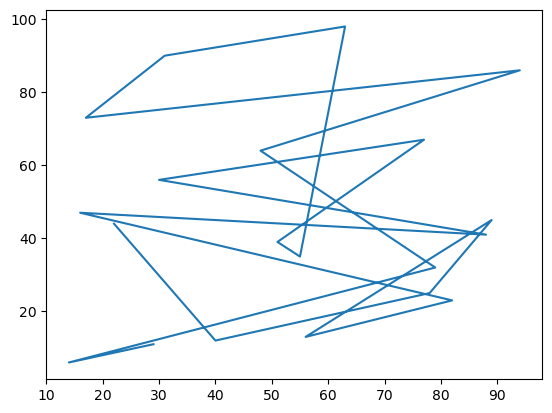
    


```python
x = range(5)
x = np.array(x)
fig, ax = plt.subplots(1, 2, figsize=(12, 5))
print("Tipo de ax = ", type(ax))
print("Conteúdo de ax[0] = ", ax[0])
print("Conteúdo de ax[1] = ", ax[1])
ax[0].plot(x, x, label='eq_1')
ax[0].plot(x, x**2, label='eq_2')
ax[0].plot(x, x**3, label='eq_3')
ax[0].set_xlabel('Eixo x')
ax[0].set_ylabel('Eixo y')
ax[0].set_title("Gráfico 1")
ax[0].legend()
ax[1].plot(x, x, 'r--', label='eq_1')
ax[1].plot(x**2, x, 'b--', label='eq_2')
ax[1].plot(x**3, x, 'g--', label='eq_3')
ax[1].set_xlabel('Novo Eixo x')
ax[1].set_ylabel('Novo Eixo y')
ax[1].set_title("Gráfico 2")
ax[1].legend()
fig.show()
```

    Tipo de ax =  <class 'numpy.ndarray'>
    Conteúdo de ax[0] =  Axes(0.125,0.11;0.352273x0.77)
    Conteúdo de ax[1] =  Axes(0.547727,0.11;0.352273x0.77)


    
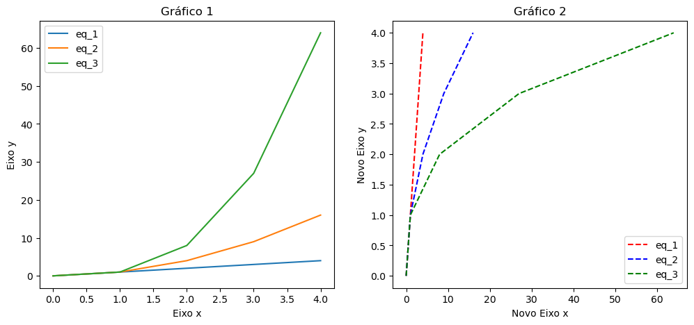
    


```python
x = range(5)
x = np.array(x)
fig = plt.subplots(figsize=(12, 5))
plt.subplot(121)
plt.plot(x, x, label='eq_1')
plt.plot(x, x**2, label='eq_2')
plt.plot(x, x**3, label='eq_3')
plt.title("Gráfico 1")
plt.xlabel('Eixo x')
plt.ylabel('Eixo y')
plt.legend()
plt.subplot(122)
plt.plot(x, x, 'r--', label='eq_1')
plt.plot(x**2, x, 'b--', label='eq_2')
plt.plot(x**3, x, 'g--', label='eq_3')
plt.title("Gráfico 2")
plt.xlabel('Novo eixo x')
plt.ylabel('Novo eixo y')
plt.legend()
plt.show()
```

    /tmp/ipykernel_2775/24402960.py:4: MatplotlibDeprecationWarning: Auto-removal of overlapping axes is deprecated since 3.6 and will be removed two minor releases later; explicitly call ax.remove() as needed.
      plt.subplot(121)


    

    


```python
import pandas as pd

dados = {'turma': ['A', 'B', 'C'], 'qtde_alunos': [33, 50, 45]}
df = pd.DataFrame(dados)
df
```


<div>
<style scoped>
    .dataframe tbody tr th:only-of-type {
        vertical-align: middle;
    }

    .dataframe tbody tr th {
        vertical-align: top;
    }

    .dataframe thead th {
        text-align: right;
    }
</style>
<table border="1" class="dataframe">
  <thead>
    <tr style="text-align: right;">
      <th></th>
      <th>turma</th>
      <th>qtde_alunos</th>
    </tr>
  </thead>
  <tbody>
    <tr>
      <th>0</th>
      <td>A</td>
      <td>33</td>
    </tr>
    <tr>
      <th>1</th>
      <td>B</td>
      <td>50</td>
    </tr>
    <tr>
      <th>2</th>
      <td>C</td>
      <td>45</td>
    </tr>
  </tbody>
</table>
</div>


```python
df.plot(x='turma', y='qtde_alunos', kind='bar')
```


    <Axes: xlabel='turma'>


    
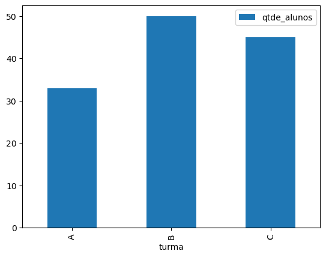
    


```python
df.plot(x='turma', y='qtde_alunos', kind='barh')
```


    <Axes: ylabel='turma'>


    
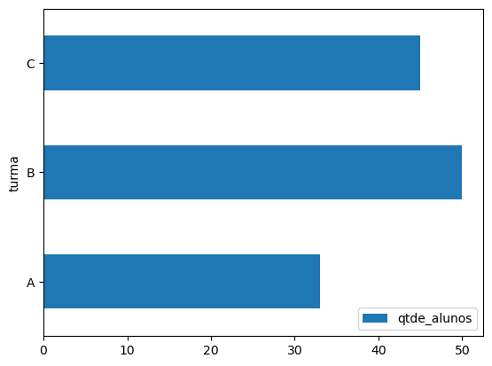
    


```python
df.plot(x='turma', y='qtde_alunos', kind='line')
```


    <Axes: xlabel='turma'>


    
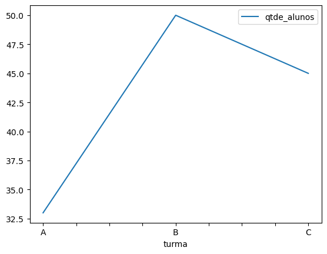
    


```python
df.set_index('turma').plot(y='qtde_alunos', kind='pie')
```


    <Axes: ylabel='qtde_alunos'>


    
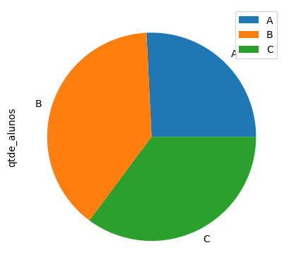
    


```python
URL = 'https://www.gov.br/anp/pt-br/centrais-de-conteudo/dados-abertos/arquivos/ie/etanol/exportacao-etanol-hidratado-2012-2021-m3.csv/@@download/file'
df_etanol = pd.read_csv(URL, sep=';')
```


```python
df_etanol.head()
```


<div>
<style scoped>
    .dataframe tbody tr th:only-of-type {
        vertical-align: middle;
    }

    .dataframe tbody tr th {
        vertical-align: top;
    }

    .dataframe thead th {
        text-align: right;
    }
</style>
<table border="1" class="dataframe">
  <thead>
    <tr style="text-align: right;">
      <th></th>
      <th>ANO</th>
      <th>PRODUTO</th>
      <th>MOVIMENTO COMERCIAL</th>
      <th>UNIDADE</th>
      <th>JAN</th>
      <th>FEV</th>
      <th>MAR</th>
      <th>ABR</th>
      <th>MAI</th>
      <th>JUN</th>
      <th>JUL</th>
      <th>AGO</th>
      <th>SET</th>
      <th>OUT</th>
      <th>NOV</th>
      <th>DEZ</th>
      <th>TOTAL</th>
    </tr>
  </thead>
  <tbody>
    <tr>
      <th>0</th>
      <td>2012</td>
      <td>ETANOL HIDRATADO</td>
      <td>EXPORTAÇÃO</td>
      <td>m3</td>
      <td>23240,019</td>
      <td>37701,75</td>
      <td>32544,915</td>
      <td>26110,145</td>
      <td>40838,313</td>
      <td>38463,751</td>
      <td>102502,628</td>
      <td>65235,388</td>
      <td>187096,731</td>
      <td>194938,064</td>
      <td>124139,351</td>
      <td>213683,449</td>
      <td>1086494,504</td>
    </tr>
    <tr>
      <th>1</th>
      <td>2013</td>
      <td>ETANOL HIDRATADO</td>
      <td>EXPORTAÇÃO</td>
      <td>m3</td>
      <td>179411,21</td>
      <td>103192,127</td>
      <td>25823,789</td>
      <td>14490,489</td>
      <td>30662,71</td>
      <td>103236,547</td>
      <td>90358,921</td>
      <td>94403,433</td>
      <td>115838,513</td>
      <td>161414,721</td>
      <td>122145,833</td>
      <td>69596,688</td>
      <td>1110574,981</td>
    </tr>
    <tr>
      <th>2</th>
      <td>2014</td>
      <td>ETANOL HIDRATADO</td>
      <td>EXPORTAÇÃO</td>
      <td>m3</td>
      <td>92985,931</td>
      <td>59806,023</td>
      <td>26149,936</td>
      <td>37560,243</td>
      <td>19795,784</td>
      <td>64522,802</td>
      <td>49595,918</td>
      <td>41999,877</td>
      <td>46301,679</td>
      <td>72902,913</td>
      <td>50971,719</td>
      <td>78438,177</td>
      <td>641031,002</td>
    </tr>
    <tr>
      <th>3</th>
      <td>2015</td>
      <td>ETANOL HIDRATADO</td>
      <td>EXPORTAÇÃO</td>
      <td>m3</td>
      <td>57560,264</td>
      <td>31102,65</td>
      <td>71837,292</td>
      <td>8429,754</td>
      <td>16760,704</td>
      <td>24468,809</td>
      <td>140172,215</td>
      <td>72711,237</td>
      <td>52264,181</td>
      <td>107861,466</td>
      <td>82277,943</td>
      <td>171143,391</td>
      <td>836589,906</td>
    </tr>
    <tr>
      <th>4</th>
      <td>2016</td>
      <td>ETANOL HIDRATADO</td>
      <td>EXPORTAÇÃO</td>
      <td>m3</td>
      <td>73399,284</td>
      <td>192061,229</td>
      <td>75194,772</td>
      <td>21283,088</td>
      <td>59300,976</td>
      <td>141364,399</td>
      <td>94266,978</td>
      <td>58584,587</td>
      <td>126300,867</td>
      <td>22454,195</td>
      <td>20054,398</td>
      <td>20054,398</td>
      <td>904319,171</td>
    </tr>
  </tbody>
</table>
</div>


```python
df_etanol.drop(columns=['PRODUTO', 'MOVIMENTO COMERCIAL', 'UNIDADE'],
               inplace=True)
for mes in 'JAN FEV MAR ABR MAI JUN JUL AGO SET OUT NOV DEZ TOTAL'.split():
    df_etanol[mes] = df_etanol[mes].str.replace(',', '.')
df_etanol = df_etanol.astype(float)
df_etanol['ANO'] = df_etanol['ANO'].astype(int)

df_etanol.head(2)
```


<div>
<style scoped>
    .dataframe tbody tr th:only-of-type {
        vertical-align: middle;
    }

    .dataframe tbody tr th {
        vertical-align: top;
    }

    .dataframe thead th {
        text-align: right;
    }
</style>
<table border="1" class="dataframe">
  <thead>
    <tr style="text-align: right;">
      <th></th>
      <th>ANO</th>
      <th>JAN</th>
      <th>FEV</th>
      <th>MAR</th>
      <th>ABR</th>
      <th>MAI</th>
      <th>JUN</th>
      <th>JUL</th>
      <th>AGO</th>
      <th>SET</th>
      <th>OUT</th>
      <th>NOV</th>
      <th>DEZ</th>
      <th>TOTAL</th>
    </tr>
  </thead>
  <tbody>
    <tr>
      <th>0</th>
      <td>2012</td>
      <td>23240.019</td>
      <td>37701.750</td>
      <td>32544.915</td>
      <td>26110.145</td>
      <td>40838.313</td>
      <td>38463.751</td>
      <td>102502.628</td>
      <td>65235.388</td>
      <td>187096.731</td>
      <td>194938.064</td>
      <td>124139.351</td>
      <td>213683.449</td>
      <td>1086494.504</td>
    </tr>
    <tr>
      <th>1</th>
      <td>2013</td>
      <td>179411.210</td>
      <td>103192.127</td>
      <td>25823.789</td>
      <td>14490.489</td>
      <td>30662.710</td>
      <td>103236.547</td>
      <td>90358.921</td>
      <td>94403.433</td>
      <td>115838.513</td>
      <td>161414.721</td>
      <td>122145.833</td>
      <td>69596.688</td>
      <td>1110574.981</td>
    </tr>
  </tbody>
</table>
</div>


```python
df_etanol.plot(x='ANO',
               y='JAN',
               kind='bar',
               figsize=(10, 5),
               rot=0,
               fontsize=12,
               legend=False)
df_etanol.plot(x='ANO',
               y='JAN',
               kind='line',
               figsize=(10, 5),
               rot=0,
               fontsize=12,
               legend=False)
```


    <Axes: xlabel='ANO'>


    
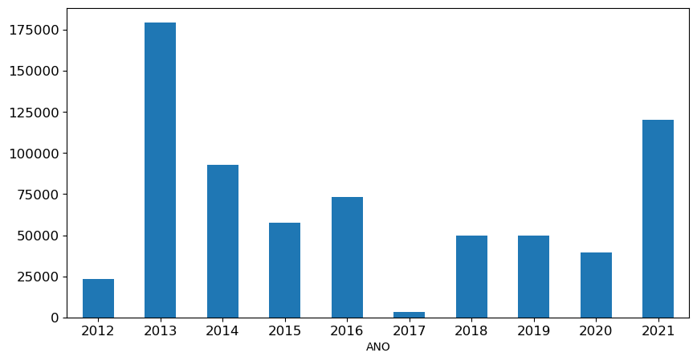
    


    
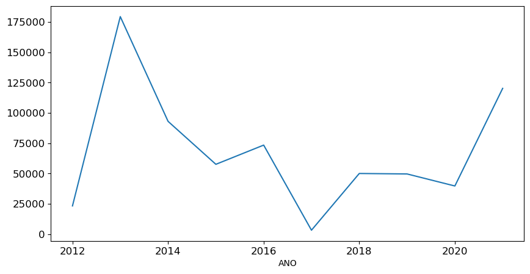
    


```python
df_etanol[['ANO', 'JAN', 'FEV']].plot(x='ANO',
                                      kind='bar',
                                      figsize=(10, 5),
                                      rot=0,
                                      fontsize=12)
```


    <Axes: xlabel='ANO'>


    
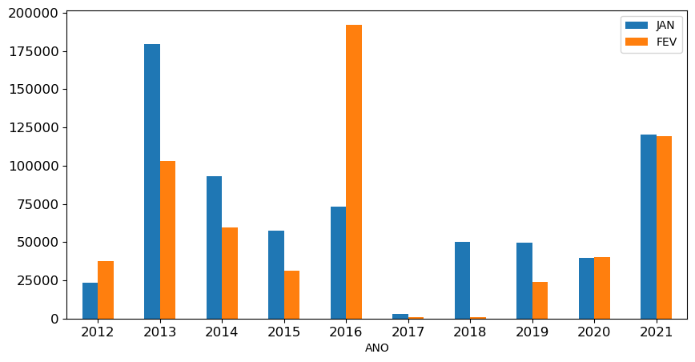
    


## Seaborn

    conda install seaborn


```python
import seaborn as sns
```


```python
df_tips = sns.load_dataset('tips')
```


```python
df_tips.info()
```

    <class 'pandas.core.frame.DataFrame'>
    RangeIndex: 244 entries, 0 to 243
    Data columns (total 7 columns):
     #   Column      Non-Null Count  Dtype   
    ---  ------      --------------  -----   
     0   total_bill  244 non-null    float64 
     1   tip         244 non-null    float64 
     2   sex         244 non-null    category
     3   smoker      244 non-null    category
     4   day         244 non-null    category
     5   time        244 non-null    category
     6   size        244 non-null    int64   
    dtypes: category(4), float64(2), int64(1)
    memory usage: 7.4 KB


```python
df_tips.head()
```


<div>
<style scoped>
    .dataframe tbody tr th:only-of-type {
        vertical-align: middle;
    }

    .dataframe tbody tr th {
        vertical-align: top;
    }

    .dataframe thead th {
        text-align: right;
    }
</style>
<table border="1" class="dataframe">
  <thead>
    <tr style="text-align: right;">
      <th></th>
      <th>total_bill</th>
      <th>tip</th>
      <th>sex</th>
      <th>smoker</th>
      <th>day</th>
      <th>time</th>
      <th>size</th>
    </tr>
  </thead>
  <tbody>
    <tr>
      <th>0</th>
      <td>16.99</td>
      <td>1.01</td>
      <td>Female</td>
      <td>No</td>
      <td>Sun</td>
      <td>Dinner</td>
      <td>2</td>
    </tr>
    <tr>
      <th>1</th>
      <td>10.34</td>
      <td>1.66</td>
      <td>Male</td>
      <td>No</td>
      <td>Sun</td>
      <td>Dinner</td>
      <td>3</td>
    </tr>
    <tr>
      <th>2</th>
      <td>21.01</td>
      <td>3.50</td>
      <td>Male</td>
      <td>No</td>
      <td>Sun</td>
      <td>Dinner</td>
      <td>3</td>
    </tr>
    <tr>
      <th>3</th>
      <td>23.68</td>
      <td>3.31</td>
      <td>Male</td>
      <td>No</td>
      <td>Sun</td>
      <td>Dinner</td>
      <td>2</td>
    </tr>
    <tr>
      <th>4</th>
      <td>24.59</td>
      <td>3.61</td>
      <td>Female</td>
      <td>No</td>
      <td>Sun</td>
      <td>Dinner</td>
      <td>4</td>
    </tr>
  </tbody>
</table>
</div>


```python
fig, ax = plt.subplots(1, 3, figsize=(15, 5))
sns.barplot(data=df_tips, x='sex', y='total_bill', ax=ax[0])
sns.barplot(data=df_tips, x='sex', y='total_bill', ax=ax[1], estimator=sum)
sns.barplot(data=df_tips, x='sex', y='total_bill', ax=ax[2], estimator=len)
```


    <Axes: xlabel='sex', ylabel='total_bill'>


    
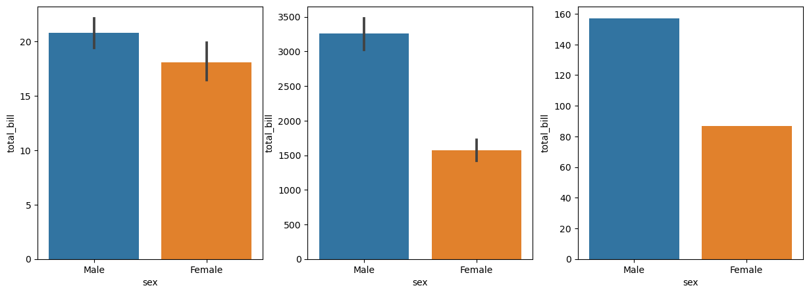
    


```python
plt.figure(figsize=(10, 5))
ax = sns.barplot(x="day", y="total_bill", data=df_tips)
ax.axes.set_title("Venda média diária", fontsize=14)
ax.set_xlabel("Dia", fontsize=14)
ax.set_ylabel("Venda média ", fontsize=14)
ax.tick_params(labelsize=14)
```


    
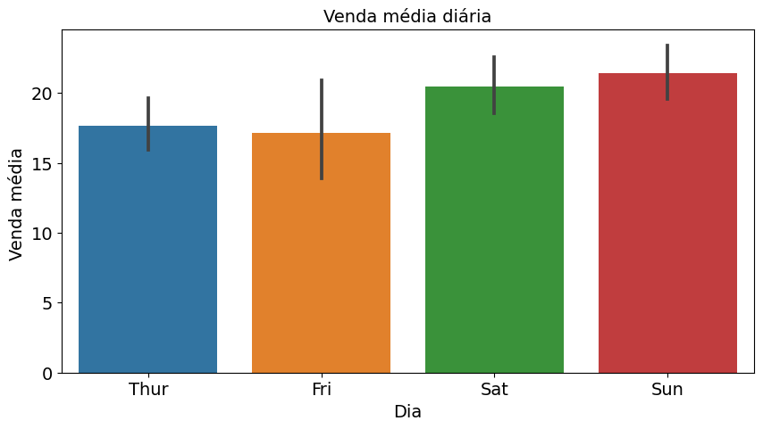
    


```python
plt.figure(figsize=(10, 5))
sns.countplot(data=df_tips, x="day")
```


    <Axes: xlabel='day', ylabel='count'>


    
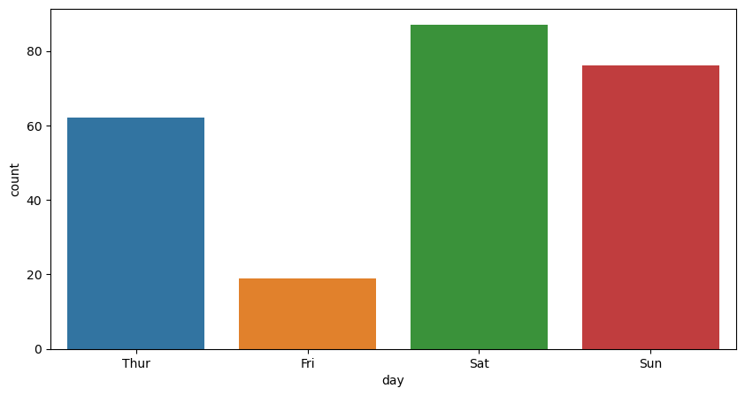
    


```python
plt.figure(figsize=(10, 5))
sns.countplot(data=df_tips, x="day", hue="sex")
```


    <Axes: xlabel='day', ylabel='count'>


    
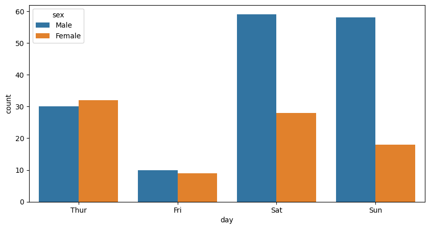
    


```python
plt.figure(figsize=(10, 5))
sns.scatterplot(data=df_tips, x="total_bill", y="tip")
```


    <Axes: xlabel='total_bill', ylabel='tip'>


    
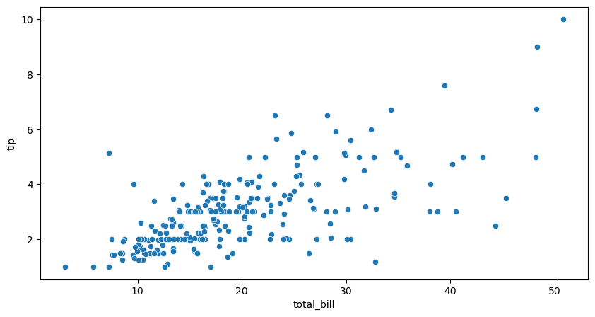

<br><sub>Last edited: 2025-05-11 21:36:25</sub>
