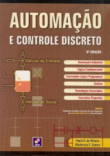
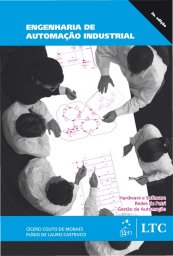
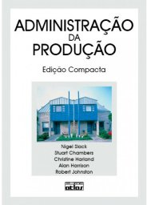
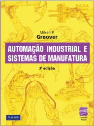

# Organização Industrial e Automação

2º sem 2017

## Ementa

- Conceitos de organização e de empresas. 
- Métodos de planejamento e controle. 
- Introdução ao processo de automação. 
- Universo da automação industrial e perspectivas. 
- Estabilidade e desempenho de sistemas realimentados. 
- Controle de sistemas a eventos discretos. 
- Práticas de controle e automação. 
- Requisitos dos sistemas informáticos para automação. 
- Controle de processo e automação da manufatura. 
- Processos e modelos de processos.

## Referências

   

- SILVEIRA, Paulo Rogério da; SANTOS, Winderson Eugenio dos. *Automação e controle discreto*. 6. ed. São Paulo: Érica, 1999.
- MORAES, Cícero Couto de; CASTRUCCI, Plínio. *Engenharia de automação industrial*. Rio de Janeiro: LTCLivros Técnicos e Científicos S. A. 2001.
- SLACK, Nigel et al. *Administração da Produção*. 2. ed. São Paulo: Atlas, 2002.
- GROOVER, Mikell P. *Automação Industrial e Sistemas de Manufatura*. 3. ed. São Paulo: Pearson Prentice Hall, 2011.

 Last edited: 2025-02-23 11:45:56
