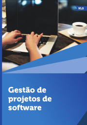

# Projeto Integrado

1º sem 2025, 1º e 2º sem 2024

## Ementa

- Contextualização acerca do Projeto Integrado. 
- Introdução ao PMI, guia PMBOK e sua estrutura. 
- Desenvolvimento do Plano de Gerenciamento do Projeto. 
- Desenvolvimento do Termo de Abertura do Projeto. 
- Orientação e Gerenciamento do Trabalho do Projeto. 
- Aplicação prática do Gerenciamento da Integração. 
- Planejamento do Gerenciamento do Cronograma. 
- Definição das atividades. 
- Sequenciamento das atividades. 
- Aplicação prática do Gerenciamento do Tempo. 
- Desenvolvimento do cronograma. 
- Estimativa da duração das atividades. 
- Estimativa dos recursos das atividades. 
- Planejamento do Gerenciamento dos Custos. 
- Estimativa dos Custos. 
- Determinação do orçamento. 
- Aplicação prática do Gerenciamento dos Custos.

## Referências

- ARTERO, M. A. *Gestão de Projetos de Software*. Londrina: EDE SA, 2016. ISBN 978-85-8482-671-1.

 Last edited: 2025-02-23 11:46:21
