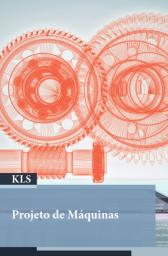
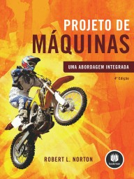

# Projeto de Máquinas

1º sem 2023

## Ementa

- Fundamentos gerais sobre o projeto de máquinas
     - Introdução ao projeto de máquinas: conceitos e definições
     - Avaliação de aspectos técnicos e econômicos
     - Métodos, custos, ferramental, seleção de materiais, cronograma
- Análise e modelagem básica de uma máquina
     - Análise de falhas e cálculo de esforços
     - Análise dimensional e estrutural
     - Prototipagem
- Dimensionamento do sistema de transmissão de potência
     - Dimensionamento do sistema de transmissão de potência
     - Elementos de ligação
     - Projeto de elementos de transmissão
- Dimensionamento do sistema básico de potência
     - Mancais, freios e cilindros pressurizados
     - Elementos de potência
     - Elementos auxiliares de potência

## Referências

 

- LOBO, Y. R. de O.; JÚNIOR, I. E. de O.; ESTAMBASSE, E. C.; SHIGUEMOTO, A. C. G. Projeto de máquinas. Londrina: Editora e Distribuidora Educacional S.A., 2019. ISBN 978-85-522-1466-3
- NORTON, R. L.; BOOKMAN, E.; STAVROPOULOS, K. D.; AGUIAR, J. B. de; AGUIAR, J. M. de; MACHNIEVSCZ, R.; CASTRO, J. F. de. Projeto de Máquinas: Uma Abordagem Integrada. 4ª edição. [S. l.]: Bookman, 2013. ISBN 978-85-8260-022-1

### Material de sala de aula

* MIRANDA, E. F. Análise de falhas e cálculo de esforços. Projeto de Máquina. São Paulo: Scientia, 2023a. Disponível em: <https://repositorio.pgsscogna.com.br/handle/123456789/59641>.
* MIRANDA, E. F. Análise dimensional e estrutural. Projeto de Máquina. São Paulo: Scientia, 2023b. Disponível em: <https://repositorio.pgsscogna.com.br/handle/123456789/59642>.
* MIRANDA, E. F. Avaliação de aspectos técnicos e econômicos. Projeto de Máquina. São Paulo: Scientia, 2023c. Disponível em: <https://repositorio.pgsscogna.com.br/handle/123456789/59639>.
* MIRANDA, E. F. Dimensionamento do sistema de transmissão de potência. Projeto de Máquina. São Paulo: Scientia, 2023d. Disponível em: <https://repositorio.pgsscogna.com.br/handle/123456789/59644>.
* MIRANDA, E. F. Elementos auxiliares de potência. Projeto de Máquina. São Paulo: Scientia, 2023e. Disponível em: <https://repositorio.pgsscogna.com.br/handle/123456789/59649>.
* MIRANDA, E. F. Elementos de ligação. Projeto de Máquina. São Paulo: Scientia, 2023f. Disponível em: <https://repositorio.pgsscogna.com.br/handle/123456789/59645>.
* MIRANDA, E. F. Elementos de potência. Projeto de Máquina. São Paulo: Scientia, 2023g. Disponível em: <https://repositorio.pgsscogna.com.br/handle/123456789/59648>.
* MIRANDA, E. F. Introdução ao projeto de máquina. Projeto de Máquina. São Paulo: Scientia, 2023h. Disponível em: <https://repositorio.pgsscogna.com.br/handle/123456789/59638>.
* MIRANDA, E. F. Mancais, freios e cilindros pressurizados. Projeto de Máquina. São Paulo: Scientia, 2023i. Disponível em: <https://repositorio.pgsscogna.com.br/handle/123456789/59647>.
* MIRANDA, E. F. Métodos, custos, ferramental, materiais, cronograma. Projeto de Máquina. São Paulo: Scientia, 2023j. Disponível em: <https://repositorio.pgsscogna.com.br/handle/123456789/59640>.
* MIRANDA, E. F. Projeto de elementos de transmissão. Projeto de Máquina. São Paulo: Scientia, 2023k. Disponível em: <https://repositorio.pgsscogna.com.br/handle/123456789/59646>.
* MIRANDA, E. F. Prototipagem. Projeto de Máquina. São Paulo: Scientia, 2023l. Disponível em: <https://repositorio.pgsscogna.com.br/handle/123456789/59643>.

## *Links* de interesse

- BRASIL ESCOLA. Seminário. <https://brasilescola.uol.com.br/redacao/o-seminarioque-e-como-realizalo.htm>
- BRASIL ESCOLA. Relatório. <https://youtu.be/s_ogx2xROb0>
- DOS REIS, A. D. Elaboração de Projeto. <https://youtu.be/S-4tSLwc_yU>
- ROCHA, F. Como fazer seminário? <https://youtu.be/3l6D0rgEdAI>
- MAY, F. Dicas Para Apresentar Trabalho Escolar. <https://youtu.be/Xokn9aWLD08>
- SCHULTZ, C. GanttProject. <https://www.youtube.com/@xxultz/search?query=ganttproject>

## Software

- Autodesk Inventor Fusion 2013 R1. Disponível em <https://web.archive.org/web/20131119033917/http://labs.autodesk.com/technologies/fusion/>. Apesar de ser uma versão antiga e limitada, ela é *free* e a licença não expira.

## Projeto

Dentre os objetivos do projeto final da disciplina, estão:

- Refletir sobre a vivência prática da profissão
- Articular o desempenho profissional e acadêmico do discente
- Estimular o raciocínio crítico, com base em literatura atualizada
- Incentivar a produção de conhecimento

 Last edited: 2025-02-23 11:52:22
