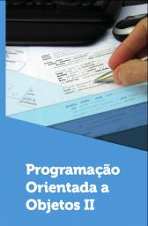
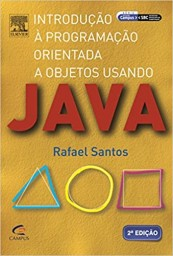

# Programação Orientada a Objetos II

1º sem 2023

## Ementa

- Programação orientada a eventos com interfaces gráficas e banco de dados relacional
    - Desenvolvimento de interfaces gráficas na linguagem Java
    - Programação em Java usando orientação a eventos
    - Programação em Java usando bando de dados relacional
- Programação Concorrente orientada a objetos
    - Programação em Java usando threads
    - Definição e tratamento de exceções para sistemas com threads
    - Programação em Java utilizando elementos para sincronização em Java
- Padrões de projeto, ferramentas e métodos ágeis
    - Ferramentas para programação em linguagem orientadas a objetos
    - Padrões de projetos em orientação a objetos
    - Métodos ágeis em orientação a objetos
- Novas tecnologias para programação em banco de dados
    - Banco de dados NoSql
    - Introdução ao desenvolvimento em Java usando mongoDB
    - Desenvolvimento em Java usando mongoDB

## Referências

 

- ANDRIJAUSKAS, F. Programação orientada a objetos II. Londrina: Editora e Distribuidora Educacional S.A, 2018. ISBN 978-85-522-1166-2
- SANTOS, R. Introdução à programação orientada a objetos usando java. [S. l.]: Elsevier Brasil, 2013. ISBN 978-85-352-8429-4

## *Links* de interesse

- BRASIL ESCOLA. Seminário. https://brasilescola.uol.com.br/redacao/o-seminarioque-e-como-realizalo.htm
- BRASIL ESCOLA. Relatório. https://youtu.be/s_ogx2xROb0
- DOS REIS, A. D. Elaboração de Projeto. https://youtu.be/S-4tSLwc_yU
- ROCHA, F. Como fazer seminário? https://youtu.be/3l6D0rgEdAI
- MAY, F. Dicas Para Apresentar Trabalho Escolar. https://youtu.be/Xokn9aWLD08
- SCHULTZ, C. GanttProject. www.youtube.com/@xxultz/search?query=ganttproject

## Projeto

Dentre os objetivos do projeto final da disciplina, estão:

- Refletir sobre a vivência prática da profissão
- Articular o desempenho profissional e acadêmico do discente
- Estimular o raciocínio crítico, com base em literatura atualizada
- Incentivar a produção de conhecimento

 Last edited: 2025-02-23 11:52:32
