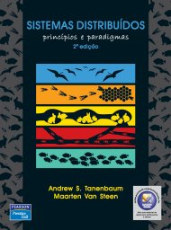

# Fundamentos da Programação Paralela e Distribuída

2º sem 2019

## Ementa

- Paradigmas de Sistemas Distribuídos. 
- Modelos e arquitetura de Programação Distribuída e Paralela. 
- Processos. 
- Comunicação entre processos. 
- Programação com Sockets, Java/RMI. 
- Conceitos de sincronização, consistência, replicação, tolerância a falha, segurança. 
- Sistemas distribuídos baseados em objetos: EJB, CORBA. 
- Sistemas distribuídos baseados na Web. 
- Computação Peer-to-Peer.

## Referências

- TANENBAUM, Andrew S.; STEEN, Maarten Van. *Sistemas Distribuídos*: princípios e paradigmas. 2 ed. São Paulo: Pearson, 2007

 Last edited: 2025-02-23 11:52:41
