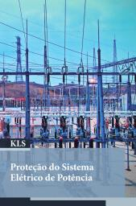

# Proteção do Sistema Elétrico de Potência

2º sem 2022

## Ementa

- Filosofia da proteção de sistemas elétricos.
- Característica de operação dos relés.
- Transformadores de instrumentação (TC e TP) e disjuntores de potência.
- Proteção de transformadores.
- Proteção de linhas de transmissão (LT).
- Proteção de geradores e barramentos.
- Equipamentos de proteção das redes primárias de distribuição.
- Principais relés empregados na proteção das redes de distribuição primárias.
- Coordenação da proteção das redes de distribuição primárias.
- Componentes simétricas e teorema de Thévenin.
- Curto-circuito simétrico.
- Curto-circuito assimétrico.

## Referências

- FRAZÃO, RJA. *Proteção do Sistema Elétrico de Potência*. 2019. ISBN 978-85-522-1435-9.

 Last edited: 2025-02-23 11:52:53
