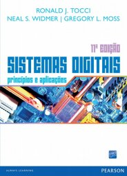

# Sistemas Digitais

1º sem 2019

## Ementa

- Sistemas de numeração. 
- Álgebra de Boole. 
- Circuitos combinacionais. 
- Circuitos sequenciais síncronos e assíncronos (“Flip-Flops e Dispositivos Correlatos”). 
- Famílias de circuitos lógicos. 
- Dispositivos lógicos programáveis. 
- Gate Arrays. 
- Análise e projeto de sistemas digitais.

## Referências

- TOCCI, Ronald J. ; WIDMER, Neal S.. *Sistemas Digitais*: princípios e aplicações. 11 ed. Rio de Janeiro: Pearson, 2011.

 Last edited: 2025-02-23 11:53:10
