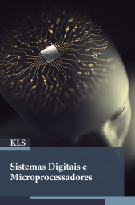
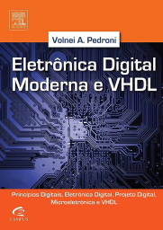

# Sistemas Digitais e Microprocessadores

2º sem 2023

## Ementa

- Circuitos digitais e álgebra booleana
  - Bases numéricas e códigos
  - Introdução à álgebra booleana
  - Circuitos digitais
- Circuitos lógicos combinacional e sequencial
  - Introdução à lógica combinacional e sequencial
  - Circuitos combinacionais
  - Flip-flops e circuitos correlatos
- Arquitetura de microprocessadores e microcontroladores
  - Introdução ao microprocessamento
  - Arquitetura RISC
  - Arquitetura CISC
- Programação de microprocessadores e microcontroladores
  - Microcontrolador: Arduino
  - Novas arquiteturas e tendências
  - Aplicações para processadores ARM

## Referências

  

- PERIM, V.; LOPES, G. M. G.; MARTIN, A. A. *Sistemas Digitais e Microprocessadores*. Londrina: Editora e Distribuidora Educacional S.A., 2020.
- PEDRONI, V. *Digital electronics and design with VHDL*. USA: Morgan Kaufmann, 2008. ISBN 978-0080557557
- PEDRONI, V. *Eletrônica digital moderna e VHDL*. 1ª edição. Rio de Janeiro, RJ: GEN LTC, 2010. ISBN 978-8535234657 (Tradução do original em Inglês) 

## Vídeos de interesse

- UNIVESP. [Introdução a Conceitos de Computação - Sistemas de numeração e conversão de bases](https://youtu.be/5Fcbp4nRWsk). (U1S1)
- UNIVESP. [Circuitos Lógicos - Álgebra Booleana](https://youtu.be/cklFKRutr2k). (U1S2)
- UNIVESP. [Circuitos Digitais - Introdução aos Circuitos Digitais](https://youtu.be/zqqYV3MUO2A). (U1S3)
- UNIVESP. [Circuitos Lógicos - Introdução à Lógica Digital](https://youtu.be/0GzaXbMNB10). (U2S1)
- UNIVESP. [Circuitos Digitais - Circuitos Combinacionais](https://youtu.be/HFXlJJsAWWI). (U2S2)
- UNIVESP. [Circuitos Lógicos - Latches e Flip-Flops](https://youtu.be/erMxPHt_ACc). (U2S3)
- BOSON. [Introdução aos Microcontroladores](https://youtu.be/1R0VkYaYjLQ). (U3S1)
- AUXILIO DIGITAL. [Arquitetura Risc (Arquitetura de computadores)](https://youtu.be/kZVxbL1WIKw). (U3S2)
- OLIVEIRA, R. F. [IFSP - Campus Hortolândia - Arquitetura de Computadores - RISC vrs CISC (Introdução)](https://youtu.be/T73gOJBg6SY). (U3S3)
- UNIVESP. [Sistemas Embarcados - Introdução aos Sistemas Embarcados e ao Ambiente de Desenvolvimento IDE](https://youtu.be/NSC_bW4vW0U). (U4S1)
- SANTIAGO, Prof. [RISC ou CISC - Introduzindo a Arquitetura do RISC-V](https://youtu.be/JJm2r8EKmek). (U4S2)
- RAINER, Prof. W. [ARM#01 - Sistemas Microprocessados ARM ](https://youtu.be/PzgDR22Fg6s) (U4S3)

## *Links* de interesse

- Página do Prof. Luiz Mesquita. <https://sites.google.com/site/luizok/semestres-anteriores/semestre-20221/sistemas-digitais-e-microprocessadores>
- BRASIL ESCOLA. *Seminário*. <https://brasilescola.uol.com.br/redacao/o-seminarioque-e-como-realizalo.htm>
- ROCHA, F. *Como fazer seminário?*. <https://youtu.be/3l6D0rgEdAI>
- MAY, F. *Dicas Para Apresentar Trabalho Escolar*. <https://youtu.be/Xokn9aWLD08>
- BRASIL ESCOLA. *Relatório*. <https://youtu.be/s_ogx2xROb0>
- DOS REIS, A. D. *Elaboração de Projeto*. <https://youtu.be/S-4tSLwc_yU>
- SCHULTZ, C. *GanttProject*. <https://www.youtube.com/@xxultz/search?query=ganttproject> (Software para Cronograma)

 Last edited: 2025-02-23 11:53:19
