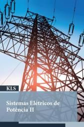
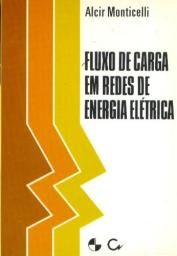
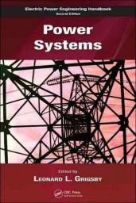

# Sistemas Elétricos de Potência

2º sem 2022

## Ementa

- Modelagem do problema de fluxo de carga.
- Formulação e resolução do problema de fluxo de carga.
- Fluxo de carga linearizado.
- Modelo das redes de distribuição.
- Fluxo de carga baseado no método da varredura.
- Análises em redes de distribuição de energia elétrica.
- Conceitos básicos de estabilidade em sistemas de potência.
- Estabilidade de tensão e colapso de tensão.
- Estabilidade de ângulo.
- Controle de tensão em sistemas de potência.
- Gerenciamento de sistemas de energia.
- Despacho econômico e fluxo de potência ótimo.

## Referências

  

- SCHINCARIOL, RS; BELIN, PR. Sistemas Elétricos de Potência II. 2019. ISBN 978-85-522-1467-0.
- MONTICELLI, AJ. Fluxo de carga em redes de energia elétrica. 1983. ISBN 9221151484.
- GRIGSBY, LL. Electric Power Engineering Handbook. 2006. ISBN 978-0-8493-9288-7.
- MONTICELLI, AJ. Fluxo de carga em redes de energia elétrica. 1983. ISBN 9221151484.
- GRIGSBY, LL. Electric Power Engineering Handbook. 2006. ISBN 978-0-8493-9288-7.
- ALMEIDA, VF. Metodologia para avaliar o impacto de técnicas de repotenciação no desempenho de linhas de transmissão em regime permanente. 2013.
- HELDWEIN, ML. Eletrônica de Potência para Redes Ativas de Distribuição. Introdução às redes de distribuição. 2012.
- Profa. Ruth Leão. www.dee.ufc.br/~rleao
- Prof. Aécio Oliveira (UFSM). Sistemas Elétricos de Potência II. <https://www.youtube.com/watch?v=YqqY95FtF8E&list=PLTtwbG6sVRRhuo5pwxMAQP8rHofoLAfy7>
- Prof. Luiz Reis (Fac. Pitágoras). Sistema Elétrico de Potência II. <https://www.youtube.com/watch?v=S7U8PRMyg9g&list=PLkblCzHdHezsqRL3eExmEx-MBdLxHvWjv>
- Prof. Carlos Castro (Unicamp). (material de várias disciplinas) <https://www.dsee.fee.unicamp.br/~ccastro>

 Last edited: 2025-02-23 11:53:26
