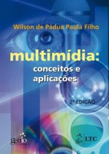

# Tópicos Especiais em Ciências da Computação

2º sem 2019

## Ementa

- Multimídia: conceitos e tipos de sistemas. 
- Tipografia. 
- Áudio: processamento e síntese de som. 
- Imagem. 
- Vídeo: interfaces e processamento. 
- Animação. 
- Interação. 
- Autoria: plataformas para multimídia. 
- Ferramentas de desenvolvimento. 
- Realidade Virtual: conceitos, tipos de sistemas e tecnologias afins.
- Dispositivos não convencionais de entrada e saída. 
- Software e linguagens para desenvolvimento de aplicações de realidade virtual. 
- Modelagem e animação tridimensional.

## Referências

- PAULA FILHO, Wilson de Padua. *Multimídia: conceitos e aplicações*. Rio de Janeiro: LTC, 2000.

 Last edited: 2025-02-23 11:53:54
