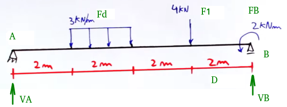
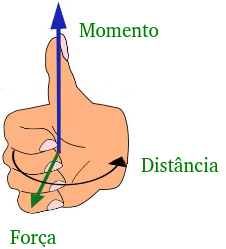
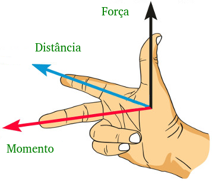
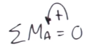
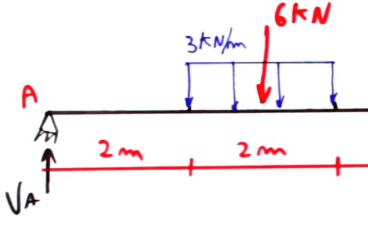
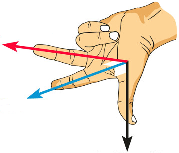

Notebook baseado no vídeo https://youtu.be/9oNLaJnpA9c "Teoria das Estruturas 02 - regra da mão direita - calculando reações".




```python
# criação das variáveis com forças e distânicas na viga
D = 2.0        # distância de um trecho
Fd = 3.0       # carga distribuída
F1 = 4.0       # força no ponto 1
FB = 2.0       # momento no apoio B
VA = VB = 0.0  # reações de apoio

D, Fd, F1, FB, VA, VB
```


    (2.0, 3.0, 4.0, 2.0, 0.0, 0.0)


Cálculo do momento que a F1 gera no ponto A.

Usando a regra da mão direita, como no vídeo: primeiro aponta os dedos no sentido da "flecha" de F1. Depois curva os dedos em direção a A. Com isso o dedão fica na direção "do caderno" indicando para onde está apontado o momento.

Um outro jeito é usar três dedos:

Primeiro fecha a mão e imagina que "força vezes distância é igual ao momento".

Daí abre o polegar (em preto) e coloca ele na direção da seta de F1. E fica firme com esse dedo, não mexe ele.

Depois abre o indicador (em azul) na direção de A, sem mexer o polegar.

E por fim abre o terceiro dedo (em vermelho) e ele indicará a direção do momento.

### Somatório das forças

Neste caso sabemos que o somatório das forças tem que ser zero.

Selecionamos o ponto A como referência e fazemos a somatória dos momentos no ponto A:


```python
SMA = 0    # inicializando a variável que vai acumular a somatória
```

Vamos convencionar que a seta de momento entrando no caderno é negativo, e saindo do caderno é posivito.

Ou de outra forma, usando a regra da mão direita, com os dedos girando no sentido anti-horário, o polegar aponta para cima, indicando momento positivo. No outro sentido indica negativo.


Calculando a força resultante F2 da carga distribuída:


```python
F2 = Fd * D    # força resultante

F2
```


    6.0


Para calcular momento de F2 com relação a A, usamos a regra da mão direita. Polegar em cima da seta de F2, não mexe nele, indicador apontando na direção de A, e dedo médio indica o sentido do momento, que neste caso é indo em direção ao caderno (imaginando o desenho feito na folha do caderno), portanto é negativo:

 


```python
MF2A = - F2 * (D + D/2)

MF2A
```


    -18.0


Agora para calcular o momento de F1, usando a regra da mão direita, polegar na seta de F1, indicador na direção de A, o dedo médio indica que o momento é negativo:


```python
MF1A = - F1 * (D * 3)

MF1A
```


    -24.0


O momento FB já é o momento, não precisa calcular nada, só precisa colocar o sinal negativo ou positivo. Usando a regra da mão direita e girando os dedos no sentido da força, o polegar fica para cima indicando positivo. Então não precisa mexer na variável FB.


```python
FB
```


    2.0


Agora passando para a próxima que é que VB.
Polegar em VB, indicador na direção de A, e o dedo médio aponta para cima indicando que o momento é positivo:

    MVB = VB * (D * 4)     # VB não conhecemos ainda

Como não tem mais forças, passamos para a somatória:

    SMA = 0 = MF2A + MF1A + FB + MVB

Substituindo MVB:

    MF2A + MF1A + FB + (VB * (D * 4)) = 0

Movendo VB para o outro lado da equação:


```python
VB = (- MF2A - MF1A - FB) / (D * 4)

print("VB=", VB, "kN")
```

    VB= 5.0 kN


Agora para achar o valor de VA, podemos somar as forças (sem somar o momento FB) e tem que dar zero:

    VA - F2 - F1 + VB = 0

Pasando o VA para o outro lado da equação:


```python
VA = F2 + F1 - VB

print("VA=", VA, "kN")
```

    VA= 5.0 kN


Agora para complementar o exercício, vá mudando as variáveis com distância e forças, e dê "restart & re-run" para ver os novos resultados.
